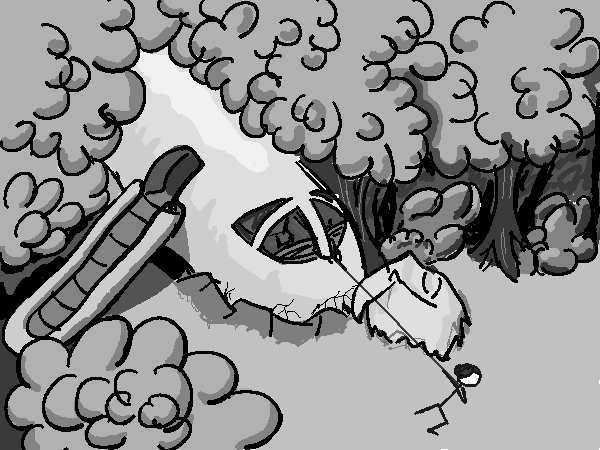

In late 2015, Twitter introduced the functionality to create polls. Jokingly, I wrote a "Choose Your Own Adventure"-style tweet and gave the readers two options on how the story should continue. When the series got more popular than I had imagined, I kept it running for over a month. Below, you can read all tweets which compose the story so far.

The motivation for this overview is that I'm starting [a second season](https://twitter.com/blinry/status/754733577464582146)!

The story also inspired a piece of fan art by [@lichtfeind](https://twitter.com/lichtfeind/status/676145963657011200):

<%= tweet(663798482570977280) %>
<%= tweet(664198040803233792) %>
<%= tweet(664554082993053697) %>
<%= tweet(664958432173268992) %>
<%= tweet(665266131918323716) %>
<%= tweet(665684913740476416) %>
<%= tweet(666009321189318664) %>
<%= tweet(666412171279114241) %>
<%= tweet(666776838111436800) %>
<%= tweet(667111599849807872) %>
<%= tweet(667475775386492929) %>
<%= tweet(667829004435456000) %>
<%= tweet(668385695925407744) %>
<%= tweet(668937940060516353) %>
<%= tweet(669243653727064068) %>
<%= tweet(669684948845113344) %>
<%= tweet(670026950522642432) %>
<%= tweet(670400313581559808) %>
<%= tweet(670763785569873920) %>
<%= tweet(671070921264898049) %>
<%= tweet(671379999971287040) %>
<%= tweet(671753951348420609) %>
<%= tweet(672176839859773441) %>
<%= tweet(672554574390108161) %>
<%= tweet(672920174861905920) %>
<%= tweet(673280404208623616) %>
<%= tweet(673630275352535040) %>
<%= tweet(674006778238078977) %>
<%= tweet(674386353614815232) %>
<%= tweet(674728013393764353) %>
<%= tweet(675336250950344704) %>
<%= tweet(675774558385872898) %>
<%= tweet(676177784436301824) %>
<%= tweet(676508258736201729) %>
<%= tweet(676843385592930304) %>
<%= tweet(677263101457129472) %>
<%= tweet(677650796696223745) %>
<%= tweet(677986603088875521) %>
<%= tweet(678522004455182336) %>
<%= tweet(679472431808004096) %>
<%= tweet(680195031697862656) %>
<%= tweet(680195312229715969) %>
