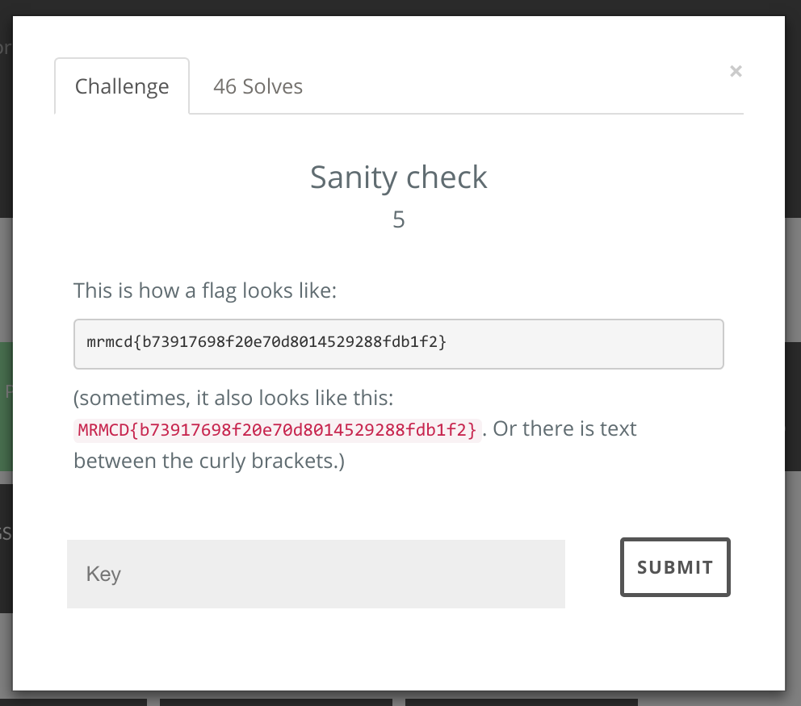

At [MRMCD17](https://2017.mrmcd.net/), [Bine](http://bleeptrack.de/), [Maxi](http://robbi5.de/) and I participated in our first *Capture The Flag* event ever. I wanted to do a quick writeup of how we solved the *Sanity Check* challenge from the "Misc" category.

The description of this challenge read as follows:

Participants were supposed to enter a flag in the text box at the bottom to solve the challenge. Note that it has a 5-star difficulty rating, but we were determined to solve it!

Thus began our descent into madness.

Thanks to the hint text, we now knew the general format of a flag, but how were we supposed to get the specific one required for this challenge? We were really surprised that, unlike other challenges, this one didn't link to any file or webpage. There was no obvious attack vector, or any other apparent source of helpful information.

First thing we did was to look at the source code of the page, but didn't find anything hidden in there. We attemted to take the description text literally and entered `mrmcd{text}`, but to no avail. Maybe there was some kind of hidden message in the hint text itself? The first letters of all words? *Tihafllsialltotitbtc*. The characters in the first column? *TmsMb*. Every fifth letter? *Tiallomaoiihsbecbe*. Nothing seemed to make any sense, we tried these as keys nevertheless. Nope. Scytale cipher? Caesar box code? ROT13? Nopenopenope.

The strings inside the example flags caught our attention, and we spent a day or so to do anything useful with them. To us, they looked like abbreviated hashes, so we rented some computation time from Amazon's AWS, and set up a hash cracker using rainbow tables. To our disappointment, after letting it run overnight it didn't come up with anything useful. We interpreted the strings as x86 assembly instructions, as ASCII, as IPv6 addresses, and as bit strings forming a QR code when arranged correctly. Nothing.

Maybe the title *Sanity Check* was supposed to be a hint? Were we actually required to prove our mental health to the CTF organizers? Google Maps listed at least different six psychotherapists nearby – but which one should we go to? Was this actually supposed to be an on-site challenge? We tried calling them, but none of them understood what we were asking about. Two of the psychotherapists pointed out that the *Central Tegmental Field* (short: "CTF") is a specific area of the human brainstem, but all our attempts to build a flag out of that information was in vain. When we called the last number, insisting that one of them *had* to an accomplice of the organizers, and were actually offered an appointment for the next afternoon, we knew we were on the wrong track.

We sneaked in the CTF operation room and attempted some social engineering. We started by thanking the team for putting together all those fun challenges (we had solved about a dozen others of them at this point). Next, we causally mentioned that we had noticed *some other teams* having problems with the Sanity Check challenge, and offered to discuss how to improve this type of challenge next time. Instead of answering, they all laughed at us, and we didn't have a choice but to laugh as well. We tried again, pointing out they had made a typo in the string inside the flag. Yeah, the second word was spelled wrong, what was it again...? But they seemed very determined not to let anything slip. We left, trying very hard to conceal our disappointment.

So... to be honest, I started this writeup under a false pretense. I promised to describe how we solved this challenge, but to this day, we haven't found a way to do it. If someone else (like one of the top three teams, *entropia*, *alech*, or *cypp*) would like to do a proper writeup of how they found the flag, we would be extremely interested to read it! But, judging from how difficult it must be to derive the flag text, we assume none of them will have the time and energy to describe all the required tools, and the elaborate process required to crack all stages of this devilish challenge. Congrats to all teams who beat it. This one was definitely above our heads.
