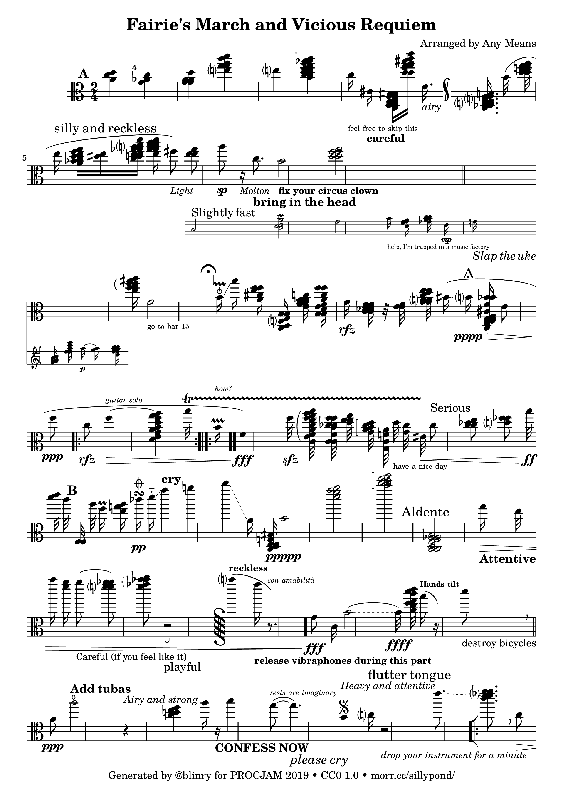

This year, I participated in [PROCJAM 2019](http://www.procjam.com) for the first time, a friendly jam around procedural generation!

My entry is called "SillyPond" (thanks for suggesting that name, [sofia](https://chaos.social/@sofia)! It's a generator for unplayable sheet music in the style of John Stump's "Faerie’s Aire and Death Waltz". Using a mixture of generative grammars, a linguistics library, noise functions, and a lot of hand-stitched random distributions, SillyPond constructs a description of sheet music, which is then converted to an image using the open-source music engraving software LilyPond.

You can find the source code [on GitHub](https://github.com/blinry/sillypond), and you can use it to generate your own sheet music! The README contains usage instructions, you'll need Ruby and LilyPond installed. Both the code and the generated files are released under the terms of [CC0 1.0](https://creativecommons.org/publicdomain/zero/1.0/). The official jam release is on [itch.io](https://blinry.itch.io/sillypond).

When working this generator, I really enjoyed that it's basically a bunch of smaller generators, bundled together: a title generator, a subtitle generator, a melody generator, an instruction generator… – and that each part can be improved separately.

Giving the page some interesting high-level structure was the most challenging part for me. Because I don't really keep a state while generating the elements, they tended to be distributed on the page pretty evenly. I solved this by using Perlin noise to influence some of the random distributions slowly, progressing down the page.

Fun fact: LilyPond can actually create MIDI files, so if you want to listen to "On the Beautiful Blue Penguin", you can find an MP3 file [here](bluepenguin.mp3)!

Some more examples:

