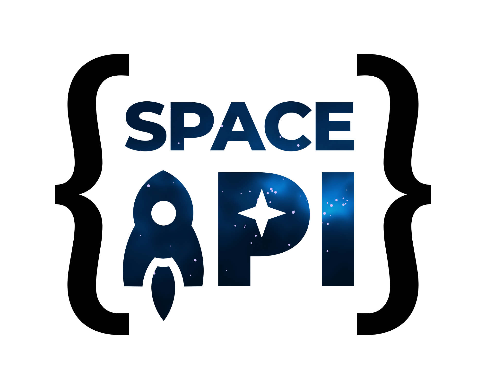

The *SpaceAPI* provides information about hackerspaces, like addresses, contact information, or door opening status. One team member maintaining this project approached me and asked if I could design a logo for them. Well, sure! :)

## Regular version

This is the normal version, which can be used in website headers, on stickers, and other merchandise:

There's also a [SVG](spaceapi.svg) of this, which can be scaled up for large print sizes, as well as a [clean, plain SVG](spaceapi-plain.svg), which does not include the fancy texture, suitable for 3D printing, milling, plotting, and so on.

## Avatar version

This is a reduced version, which looks pretty in a square and a circle, and can be used as all kinds of avatars.

This also has a [SVG](spaceapi-avatar.svg) version as well as a [plain SVG](spaceapi-avatar-plain.svg) version.

## Favicon

And finally, there's a multi-resolution [favicon](favicon.ico).
