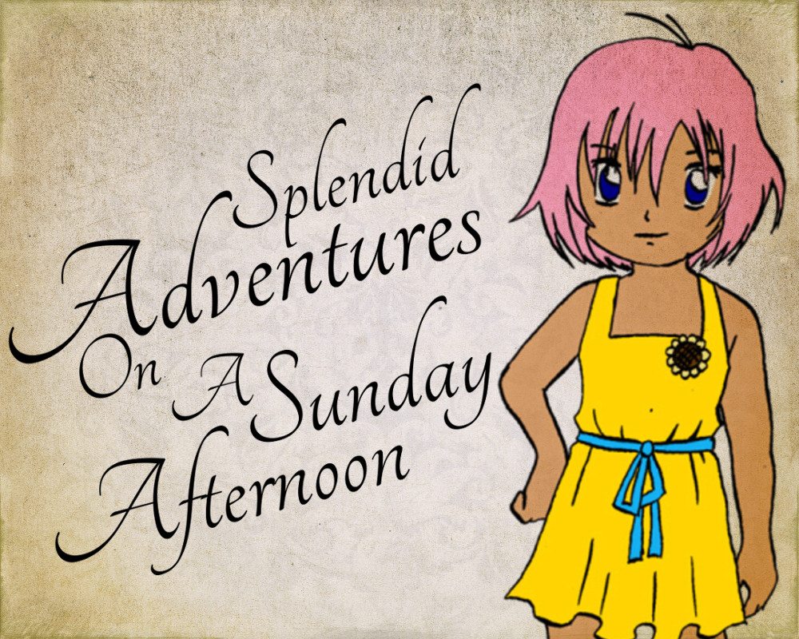
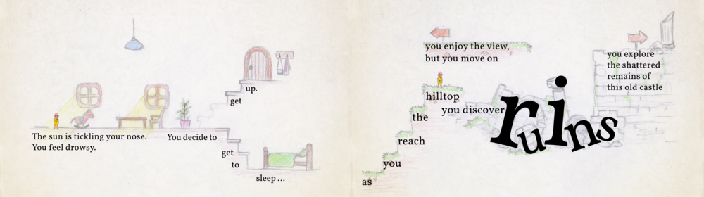
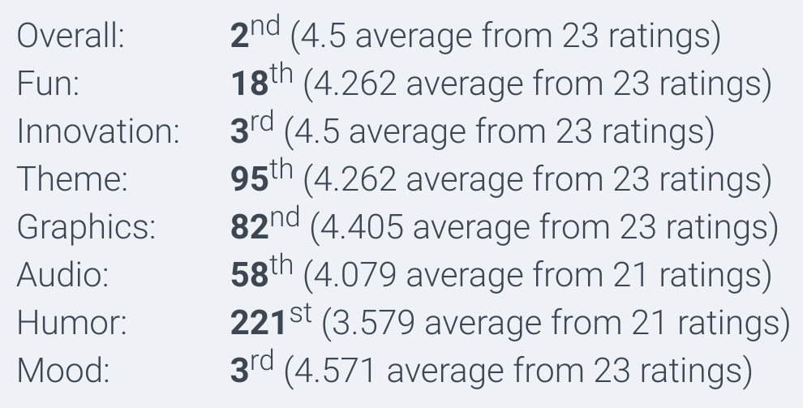

The theme of Ludum Dare 41 was "Combine two incompatible genres". I absolutely loved this theme, and we had a lot of fun brainstorming! Together with [larkinia](https://ldjam.com/users/larkinia), [Mai](https://dasmaichen.de), [rohieb](https://rohieb.name), and [Winnie](https://winniehell.de), we set out to make a crossover between a platformer, a text adventure, and a children's book. Graphics, music, and code was created by us in 72 hours.

You play the web version on [the Ludum Dare website](https://ldjam.com/events/ludum-dare/41/splendid-adventures-on-a-sunday-afternoon).

## Development

We used SVG as a level format. This was an awesome idea, because it gives you a lot of expressiveness, and a convenient editing environment with layers, locking, unlimited data attributes. The browser also does the rendering for us, and everything scales nicely.

It was also a horrible idea, because elements can be arbitrarily nested, with transformations stacked on top of each other, and path objects don't have a coordinate at all. We ended up using `getBoundingClientRect()` to fetch object positions from the browser. Then, we remember the original object positions, wrap each of them in an SVG group with a specific translation, and update that translation from the physics engine. Took us a day to get it right, but I'm happy how it turned out! :)

## Recordings

Jupi covered the game in her ongoing mission to play ALL THE indie games:

<%= youtube("WIle2FLl2RM", start: 730) %>

Joshua did a long playthrough with fun commentary!

<%= youtube("JxCDHuNO_HE") %>

Randomise User also tried the game, after the ratings were out! "You decide… to DIE!"

<%= youtube("T57TlT5CiT0", start: 210) %>

And Coconut Mouse played it without commentary:

<%= youtube("V-i008VCS9o") %>

## Comments

*What a way to do the theme! I would have never thought on doing this! Kudos to you guys! Beautiful pictures, the atmosphere and the multiple routes really make it feel like a complete game. I now really want to see more of these types of games in the future!* --SaberOfSong

*So for the entire game, I played with a childlike smile on my face.* --legavroche

*Really nice, very soothing. I was hooked and tried all the pathes. I had a very good time, thank you :).* --Kevar

## Results

To our astonishment, we made the 2nd place in the Overall category, and 3rd place in Fun and Mood! I still can't believe it. 2nd place is damn close to 1st place! :O

