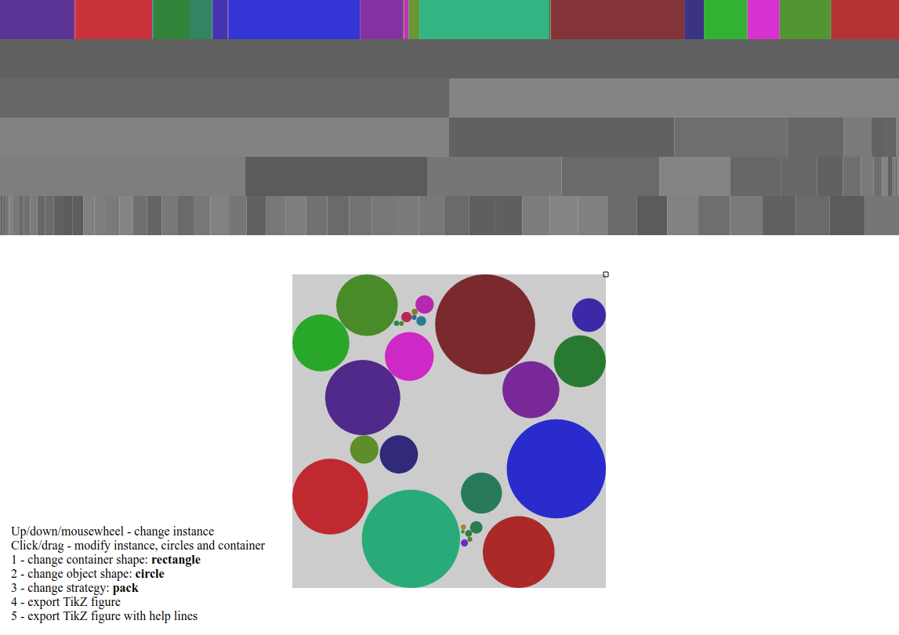

<!--<%= titlepage("split-packing", "Thesis") %>

You can find the [LaTeX source code](https://github.com/blinry/masters-thesis) on GitHub.-->

While working on this thesis, I wrote an interactive visualization tool called [*Circus*](./circus/), which I used as a personal thinking and explaining tool. You can try it out by clicking on the image below, usage instructions are located in the lower left. The tool is written in plain CoffeeScript and uses the HTML5 canvas for drawing, the [source code is on GitHub](https://github.com/blinry/circus).

