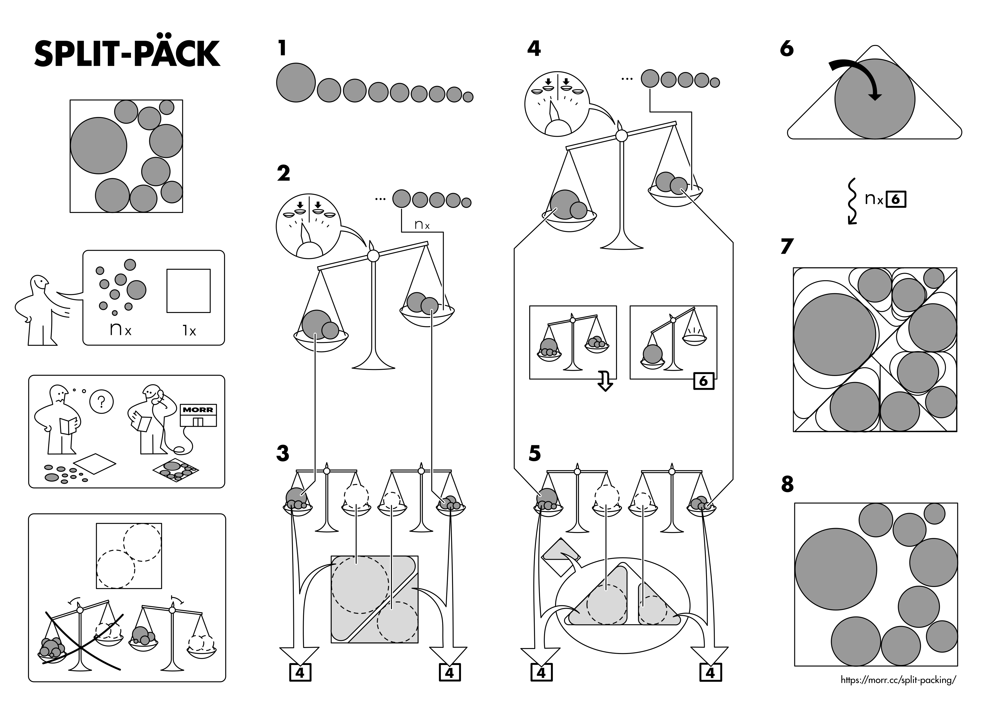

This page links to a number of scientific texts, which all were a result of my 2016 Master's Thesis: The thesis itself (which is the most complete version), a paper presented at [SODA '17](https://archive.siam.org/meetings/da17/), a paper presented at [WADS 2017](http://wads.org/), and a journal article which appeared in the [Discrete & Computational Geometry](https://www.springer.com/mathematics/journal/454) journal.

## Master's Thesis

The full name of my master's thesis is **Split Packing: An Algorithm for Packing Circles with up to Critical Density**. It covers a topic from the field of *Computational Geometry*: Packing circles into various containers, like squares and triangles.

In the thesis, I invented an algorithm which can pack circles and other objects into these containers, if their combined area does not exceed certain bounds. The special property of the algorithm is that these bounds are tight: For any larger area bound, there are circle instances which can *not* be packed.

The thesis contains a large number of figures, I'd like to invite you to take a look! :-)

<%= titlepage("split-packing", "Thesis") %> <%= titlepage("split-packing-presentation", "Presentation") %>

For the presentation I created a nonverbal description of the central algorithm in the style of IKEA assembly instructions. (Later, in 2017, I started a whole series of these, the [IDEA](/idea/) project.)

Also, while working on this thesis, I wrote an interactive visualization tool called [*Circus*](./circus/), which I used as a personal thinking and explaining tool. You can try it out by clicking on the image below, usage instructions are located in the lower left. The tool is written in CoffeeScript and uses the HTML5 canvas for drawing, the [source code is on GitHub](https://github.com/blinry/circus).

## SODA paper

A solo-authored paper version of the thesis, condensed to 10 pages, and lovingly typeset. I presented this paper at the *28th Annual ACM-SIAM Symposium on Discrete Algorithms* (SODA 2017) in Barcelona. It only covers packing circles into square containers.

<http://dl.acm.org/citation.cfm?id=3039686.3039693>

## WADS paper

This paper covers packing circles into triangular containers. I presented it at the *15th Algorithms and Data Structures Symposium* (WADS 2017) in St. John's, Canada.

<https://doi.org/10.1007/978-3-319-62127-2_32>

## DCG article

This article combines the two paper versions. You can read the [preprint at arXiv.org](https://arxiv.org/abs/1705.00924), or a [view-only version](https://link.springer.com/epdf/10.1007/s00454-018-0020-2?author_access_token=RmiFgn-97O3fhs0Ed5CyJve4RwlQNchNByi7wbcMAY4QWIrzGF-bs_5XJBDGOoG3h5JuyZQPoXODFN7HS9lZArRhW9cj1XMxJko2MiyfX4lvde60lErw5ikvaOXDgOLVMKWF1ACqUIQ0LX07XlZRPA%3D%3D) of the published article.
