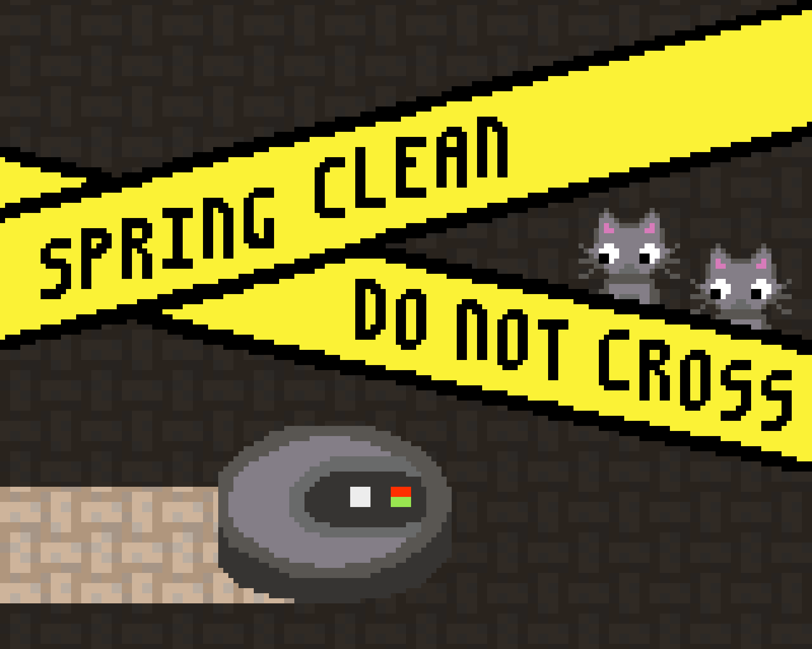
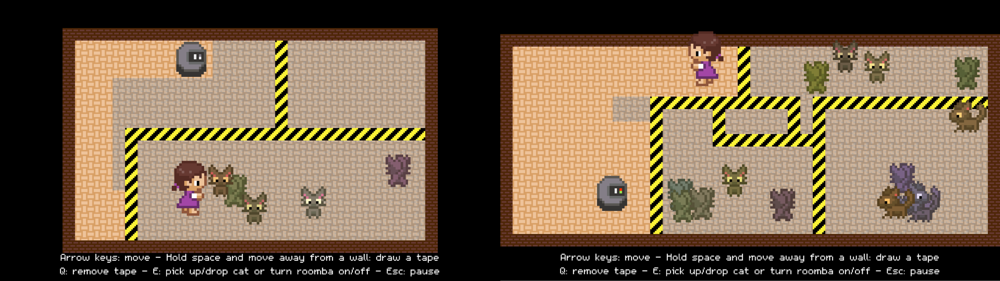
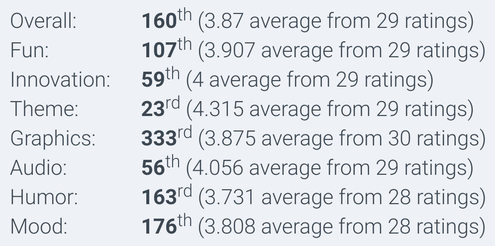

A game for Ludum Dare 40 I made with [Kiki](http://metakiki.net). Original score by [Winnie](https://winniehell.de), character graphics by [Mai](https://dasmaichen.de)! The theme was "The more you have, the worse it is".

*Spring cleaning time! But be careful to protect your increasing number of cats from your roomba by drawing lots and lots of barrier tapes!*

You can download the game (or play the web version) at [the Ludum Dare website](https://ldjam.com/events/ludum-dare/40/spring-clean-do-not-cross).

We also had a sister project, [Kittychaos](https://ldjam.com/events/ludum-dare/40/kittychaos/), created under the same roof, and partially sharing assets!

## Development

This was a rather small-scope project. We managed to implement it in two days, and had the complete third day for testing and bugfixing. Very relaxing!

## Comments

*I love the idea. And its a nice riff on those games where you divide the floor and I think I like this better than those. It feels more strategic.* --tsuk13

*Overall cute-level is 10/10. Audio complements the visuals and pushes the cute-meter to 11/10.* --Simon Rahnasto

*Cool basic mechanics! At first simple, then cat synchronization and corralling. :P Well done!* --Joror

*I love the way the vacuum cleaner moves, it’s so stupid and inefficient and I love it.* --pogo

## Recordings

Jupi did a playthrough, and decided she would rather vacuum the floor herself:

<%= youtube("H2J0D0dmydc", start: 365) %>

## Results

Results were pretty solid. We got a good Theme rating, and except for Graphics, our scores were all better than 200th place!

