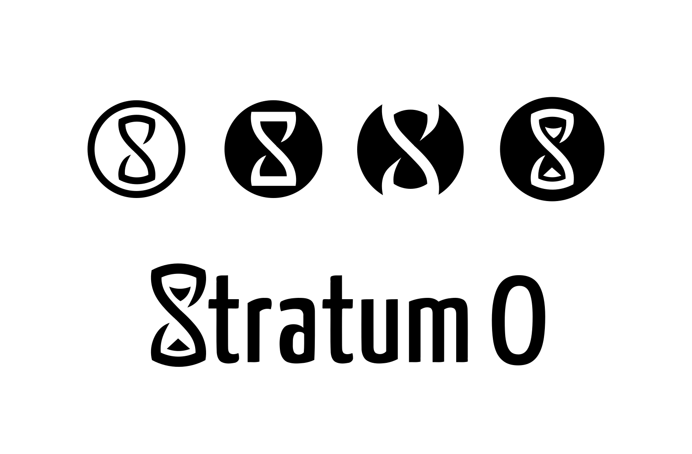

This is by far my most popular and widely-used logo up to this point. When [Stratum 0](https://stratum0.org), a [Hackerspace](http://hackerspaces.org) in Braunschweig was founded, we started a logo contest, which generated [a large body of rather nice logos](https://stratum0.org/wiki/Archiv:Logowettbewerb)! But one of my suggestions won:

It has been described as "runic", and works quite well in low resolutions. The signet incorporates both the S and the 0 of *Stratum 0*, and the hour glass connects it to the theme of *time*, because the name originates from the [Network Time Protocol](https://en.wikipedia.org/wiki/Network_Time_Protocol) (there's an atomic clock in Braunschweig). The font used in the text variant is [Yanone Kaffeesatz](https://www.yanone.de/fonts/kaffeesatz/).

I gave the logo a very permissive license, inspired by the license of [Tux](https://en.wikipedia.org/wiki/File:Tux.png), the logo of the Linux kernel:

*The copyright owner, blinry, allows free use for everything and everyone. The only condition is that you acknowledge him if someone asks.*

And I'm very glad I did!
These days, it's used on
[clothing](https://stratum0.org/wiki/Bekleidung),
in countless print products, on signs, stickers, and presentation slides,
it appeared in a [comic](https://stratum0.org/wiki/Datei:Stratumtroll.png),
has been [3D](https://stratum0.org/wiki/Datei:Stratum0_Test-Tag.jpg)-[printed](http://www.thingiverse.com/thing:38861),
[sawn out of wood](https://stratum0.org/wiki/Datei:20120430-Holzschild-01.jpg),
[3D-modelled](https://twitter.com/lichtfeind/status/606562532510199808),
[quadtree'd](https://stratum0.org/wiki/Datei:Foobla.jpg),
ended up in another logo for the [CTF team Stratum Auhuur](https://twitter.com/stratumauhuur)…
and is used by the band [Downshifter](https://www.downshifter-music.de/) (yes, they asked, and yes, the license was meant to be that permissive).

Here are some older variations:

Back then, I had a number of other ideas, as well. If you want to use those for your own hackerspace or whatever – they are still free, just get in touch! :)

And finally, here are two logos from before the final name for the hackerspace was even chosen! :) I still like the "Layer 8" one very much!

