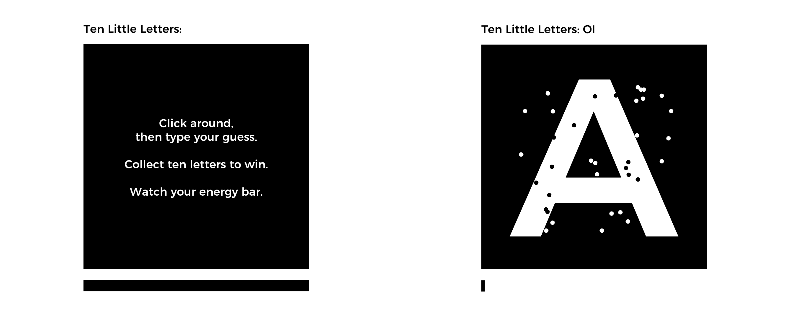

This game was a very small-scope entry for Ludum Dare 39, created during a sick day in Montreál. In contrast to my past participations, this was a solo entry, so I chose the "hard" ruleset, where you have to create the whole game from scratch, including sounds and music.

In the comments, the game was praised for its *"original concept"*, and the *"clean, simple execution"*. Many found it quite hard (including myself), but see for yourself! :)

You can download the game [from the Ludum Dare website](https://ldjam.com/events/ludum-dare/39/ten-little-letters)!

## Development

The theme for Ludum Dare 39 was "Running out of Power". I spent a few hours drafting a game in the style of Japanese number games, where you would need to *connect potato batteries to lamps* on a grid, but I didn't find a combination of gameplay elements which would make this really challenging. Another concept had the title *You are the Blackout*, where you would kill lights in a skyscraper, making the people inside panic and flee to certain locations. This led me to the idea of a platformer which would play completely in the dark, and you would have to orient yourself only via sound effects. I knew I had to reduce the scope to be able to finish this in a day, so the final game is a very reduced version of this: You click around in the dark, trying to guess which letter is there.

To be honest, this is kind of a recycled idea which I already thought of in preparation to [managore's bit jam](https://itch.io/jam/bit-jam). The challenge there was to create a game in 1-bit color, on a 1px x 1px display, without any other form of feedback. I didn't realize it back then, and I think this version with audio and graphical output is probably much more satisfying to play.
