Last week, I built a tiny Linux system from scratch, and booted it on my laptop!

Here's what it looked like:

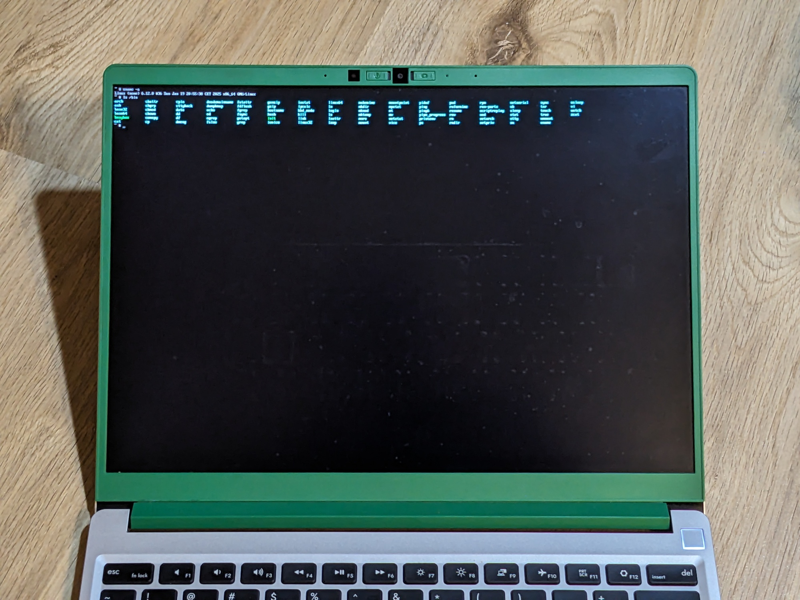

Let me tell you how I got there.

I wanted to learn more about how the Linux kernel works, and what's involved in booting it. So I set myself the goal to cobble together the *bare neccessities* required to boot into a working shell.

In the end, I had a tiny Linux system with a size of 2.5 MB, which I could boot from a USB stick on my laptop!

What you'll get out of this article:

- A better understanding of what happens when your computer boots Linux.
- What terms like bzImage, initrd and UEFI mean.
- Ideas for how to deal with the problems that I encountered.
- And if you haven't used Nix, it might be interesting to see how I used it to manage the tools and libraries I needed.

## Approach

There is a project called ["Linux From Scratch"](https://www.linuxfromscratch.org). It's a guide explaining how to set up your own Linux system by compiling everything yourself. I started following it in 2008 or so, and found it overwhelming and daunting. It requires downloading and compiling hundreds of packages by hand, and the Linux kernel is compiled only in Chapter 10. After all that preparation, you're instructed to reboot and hope for the best.

I wanted to try something simpler. Much, *much* simpler. Instead of compiling hundreds of programs, I just just need two of them: the Linux kernel, and a project called Busybox.

Note that this is not an exhaustive guide. Rather, I want to show you the problems I ran into, and how I got around them. I used an iterative approach, where I did the simplest possible thing until I ran into the next error, which was pretty fun!

## What I'll cover

1. Building a Linux kernel
2. Booting it in QEMU
3. Writing a simple "init process" (in Rust!)
4. Compiling Busybox
5. Building an initramfs
6. Making the system boot on UEFI systems
7. Booting the system on real hardware

## Building a Linux kernel

First, I downloaded the source code for the Linux kernel! I decided to use the latest mainline kernel release, which was v6.12 for me:

    git clone --depth=1 --branch=v6.12 git://git.kernel.org/pub/scm/linux/kernel/git/torvalds/linux.git

The first step was to configure the features I wanted in my kernel. `make help` lists a couple of predefined configurations, and one in particular caught my eye:

    tinyconfig - Configure the tiniest possible kernel

Sounds great! :D So I ran `make tinyconfig`. I found that this step already requires some external tools: `gcc`, `flex`, and `bison`. I put them into my shell using Nix: `nix shell nixpkgs#gcc nixpkgs#flex nixpkgs#bison` (if you're not using Nix, you could install them using your distribution's package manager).

This generated a file called `.config`, which lists which features should be enabled in the Linux kernel I was about to build!

Alright, let's do it: `make -j16`. This required another tool: `bc`. So I ran `nix shell nixpkgs#bc`. On my laptop, the compilation was *surprisingly* fast: 19 seconds! In the end, I had a 0.5 MB file called `arch/x86/boot/bzImage`. What's that?

I had seen the term "bzImage" before, but didn't really know much about it. So I looked it up [on Wikipedia](https://en.wikipedia.org/wiki/Vmlinux), and learned that it's short for "big zImage", and is basiclly a compressed, self-extracting format for storing the kernel. I'm assuming that the "z" is short for "zipped"?

## Booting the kernel in a VM

Alright, let's try to boot it in a VM! I used [QEMU](https://www.qemu.org), an open-source emulator (`nix shell nixpkgs#qemu`), which has a convenient command line flag for directly booting a kernel image:

    qemu-system-x86_64 -kernel arch/x86/boot/bzImage

Here's what happened:

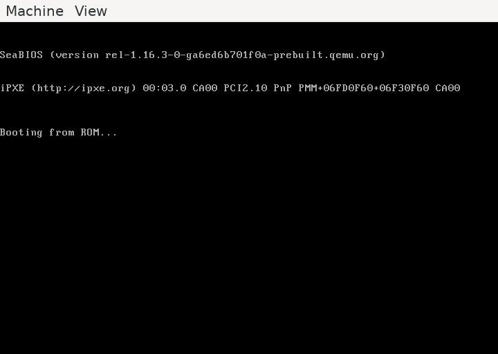

Disappointingly, the only thing QEMU displayed was "Booting from ROM...". By the way, if you click into the QEMU window, it will capture your mouse cursor! You can get it back by pressing Ctrl+Alt+G.

So I guessed I needed to enable more features in the kernel. To change the enabled features, I knew that I could run `make menuconfig`. Whoa, the last time I had done that was probably 15 years ago! The output was the following error:

    Unable to find the ncurses package

Ncurses is a library used for drawing "graphics" on the command line. Right, it might be required for rendering the terminal menu! My old `nix shell` approach didn't work here, because (I think) it only puts the binaries in the specified packages in your shell, but doesn't do anything you help your system find libraries.

So I switched to a Nix flake to specify my dependencies. I put the following in `flake.nix`, in a parent directory of the Linux kernel source code:

    {
      inputs = {
        nixpkgs.url = "github:NixOS/nixpkgs/nixos-unstable";
      };

      outputs = {nixpkgs, ...}: let
        system = "x86_64-linux";
        pkgs = nixpkgs.legacyPackages.${system};
      in {
        devShells.${system}.default = pkgs.mkShell {
          nativeBuildInputs = with pkgs; [
            gcc
            flex
            bison
            bc
            qemu
            ncurses
          ];
        };
      };
    }

I like to use [direnv](https://direnv.net) to automatically get these dependencies in my shell when I enter a project directory, so I put the following in `.envrc`:

    use flake

And ran `direnv allow`. Now, back to what I originally wanted to run: `make menuconfig`. Now, it worked!

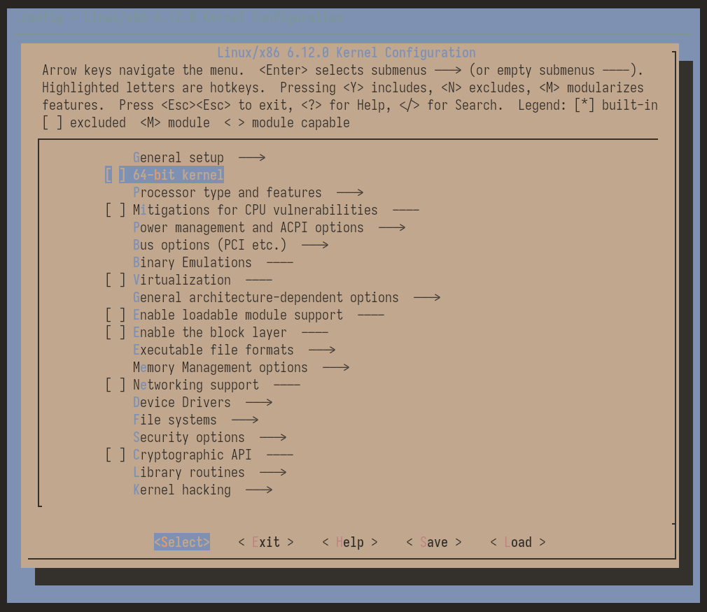

Which features should we enable to see output?

I found one feature that seemed reasonable under "Device Drivers > Character devices": "Enable TTY". The help page (which you can access using the "?" key) even says:

> Allows you to remove TTY support which can save space, and blocks features that
> require TTY from inclusion in the kernel. TTY is required for any text
> terminals or serial port communication. Most users should leave this enabled.

Oops! So I enabled it. I saved the config, and recompiled the kernel. But when I tried to boot it again in QEMU, it still didn't print anything new...

So what feature was I still missing?

One guide I found mentioned a function called `printk`, which is what the kernel uses to print messages to the kernel log. I think that's the same log displayed by the `dmesg` command! This one's located under "General setup > Configure standard kernel features (expert users)", and called "Enable support for printk". It's help says:

> This option enables normal printk support. Removing it eliminates most of the
> message strings from the kernel image and makes the kernel more or less silent.
> As this makes it very difficult to diagnose system problems, saying N here is
> strongly discouraged.

Yeah, that sounds like the problem we're having! I enabled this one, and recompiled. And finally, QEMU showed the boot log! 🎉 Very exciting! I did a little celebratory dance.

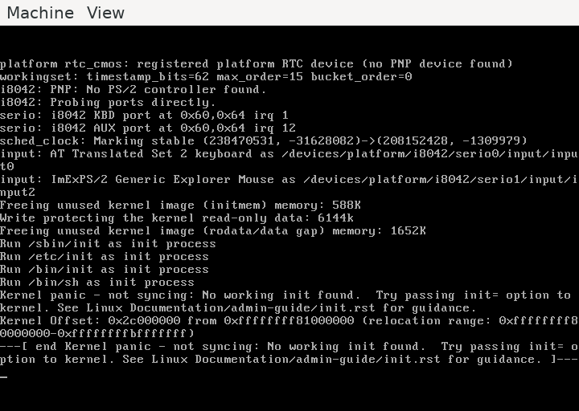

## Writing an init program (in Rust!)

You'll notice that it ends with "Kernel panic - not syncing: No working init found". Yeah, the poor kernel is all alone currently, and doesn't have anything to do after it has booted…

`init` is the first process it will run, which then takes care of everything else. On modern Linux systems, that init process (with process ID 1!) is usually `systemd`. You can check on your machine using the `ps -q 1` command. But obviously, I wanted something much (much) simpler.

What could we run as the very first process? It can't be a shell script, because we don't have a shell to execute it yet. It can't be a Python script, as we don't have a Python interpreter. No, we have to provide a binary program that doesn't depend on anything else. People call this kind of program a "statically linked" binary. There are many ways to create one, my first thought was to make one using Rust!

In a new directory, I ran `cargo new init`, and write the following `src/main.rs`, to build a "shell":

    use std::io::Write;

    fn main() {
        loop {
            print!("$ ");
            std::io::stdout().flush().unwrap();

            let mut input = String::new();
            std::io::stdin().read_line(&mut input).unwrap();

            println!("Sorry, I don't know how to do that.");
        }
    }

To compile this statically, I added `stdenv.cc.libc.static` to my flake dependencies, and ran

    RUSTFLAGS='-C target-feature=+crt-static' cargo build --release

which gave me a statically-linked binary called `target/release/init`, with a size of 1.2 MB!

## Building an initial filesystem

Okay, where do I put my `init` program? I'd like to avoid having to deal with file system drivers and disk partitions. Turns out that there's a much simpler way: You can give Linux a specific compressed archive containing some files, and it will load it into RAM, and use it as its initial root file system. The name for it is "initial ram filesystem" (short: initramfs), which is a term I had seen before, but had never understood what it was.

So I made a directory called `initramfs`, and put my `init` program there (in a newly created `bin` directory). Then, I looked up how to generate the proper archive format from this. It's this command, from the root of the `initramfs` directory:

    find . -print0 | cpio --null --create --verbose --format=newc | gzip --best > ../initrd

So an initramfs file is a "cpio archive" (which is a bit like tar), which is then gzip-compressed.

We can use QEMU to provide the initramfs to the kernel!

    qemu-system-x86_64 -kernel path/to/bzImage -initrd path/to/initrd

What happens? Same thing as before – "no working init found". :(

This stumped me for a while. It's a bit unfortunate that the kernel doesn't give more errors here, to indicate what's wrong. At some point, I realized that we're missing two more kernel features – the support for initial ram disks ("General setup > Initial RAM filesystem and RAM disk (initramfs/initrd) support") and the support for ELF binaries, the format of our Rust binary ("Executable file formats > Kernel support for ELF binaries").

When compiling this, I encountered the following error:

      CALL    scripts/checksyscalls.sh
      GEN     lib/crc32table.h
    make[3]: *** [lib/Makefile:317: lib/crc32table.h] Error 139

The "32" in the name of the file was a hint for me to turn on 64 bit support for our kernel (it's the top level setting called "64-bit kernel"). Not sure how I could've avoided this error otherwise...? But this helped (and makes a lot of sense, because we'd have to cross-compile our other programs for a 32-bit instruction set).

That fixed that crctable.h error. And gave me a *new* error, yay!

    <stdin>:1:10: fatal error: libelf.h: No such file or directory
    /home/blinry/wip/tiny-linux/linux/tools/objtool/include/objtool/elf.h:10:10: fatal error: gelf.h: No such file or directory

Some googling later, I added a new dependency: `elfutils`. Recompile (for some reason, it was important to add a `make clean` here, maybe because of the 64-bit architecture switch?), and another boot attempt.

And this (finally) worked! Linux booted, and successfully ran my tiny init program! So now I was running my own little shell (that doesn't have a lot of features):

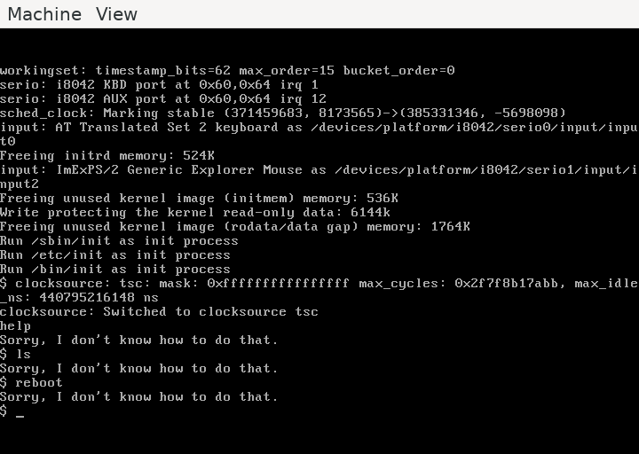

I thought this was really exciting!! (Celebratory dance number two!)

## Building Busybox

But it would be nice to have a *real* shell, right? A shell that knew how to… do something? I had heard about the "Busybox" project before, which implements some common command line utilities (like `sh`, `ls`, and even `vi`) in a single executable file. I wanted to use it to make my tiny Linux system a bit more interesting.

I downloaded the latest release:

    git clone --depth=1 --branch=1_37_0 git://git.busybox.net/busybox

And picked the default configuration this time:

    make defconfig

Let's see whether the build succeeds?

    make -j16 busybox

Nope! :D

    networking/tc.c:236:27: error: ‘TCA_CBQ_MAX’ undeclared (first use in this function); did you mean ‘TCA_CBS_MAX’?
      236 |         struct rtattr *tb[TCA_CBQ_MAX+1];
          |                           ^~~~~~~~~~~
          |                           TCA_CBS_MAX

Googling this revealed that Linux 6.8 removed a number of symbols related to network traffic control. As a workaround, we can disable this feature in Busybox. Similar to the Linux kernel, Busybox also has a `make menuconfig`! To run it, I needed to add `pkg-config` to my Nix dependencies. Next error:

     *** Unable to find the ncurses libraries or the
     *** required header files.
     *** 'make menuconfig' requires the ncurses libraries.
     *** 
     *** Install ncurses (ncurses-devel) and try again.
     *** 
    make[2]: *** [/home/blinry/wip/tiny-linux/busybox2/scripts/kconfig/lxdialog/Makefile:15: scripts/kconfig/lxdialog/dochecklxdialog] Error 1

I looked up where the error originated from - a file called `scripts/kconfig/lxdialog/check-lxdialog.sh`. To check whether it can find the ncurses library, it compiles a little example program:

    # Check if we can link to ncurses
    check() {
            $cc -x c - -o $tmp 2>/dev/null <<'EOF'
    #include CURSES_LOC
    main() {}
    EOF
        if [ $? != 0 ]; then
            echo " *** Unable to find the ncurses libraries or the"       1>&2
            echo " *** required header files."                            1>&2
            echo " *** 'make menuconfig' requires the ncurses libraries." 1>&2
            echo " *** "                                                  1>&2
            echo " *** Install ncurses (ncurses-devel) and try again."    1>&2
            echo " *** "                                                  1>&2
            exit 1
        fi
    }

I removed the redirection of the error output (`2>/dev/null`), and the error was revealed:

    <stdin>:2:1: error: return type defaults to ‘int’ [-Wimplicit-int]

Huh! So it's complaining about the missing `int` in front of the `main()` function? The fastest way to fix this for me was to add that `int`, then running `make menuconfig` worked!

Back to my original problem, disabling network traffic control. I disabled "Networking Utilities > tc". While I was there, I also activated static linking under "Settings > Build static binary", which I knew would be required for our tiny Linux to run it.

Another attempt at running `make -j16`! Success! This gave me a small (2.4 MB) `busybox` binary in my current directory.

## Launching a Busybox shell

Alright! My goal was to run the Busybox-provided shell as our first process. Busybox uses a trick to allow users to run it as many different commands: Depending on the filename, the binary does different things! And you might've noticed that Linux tries to run different commands as the init process, including `/bin/sh`!

So we can copy the `busybox` binary into our `initramfs/bin/` directory, and then create a symlink to it from `bin/sh`:

    ln initramfs/bin/sh -s busybox

I re-built the initramfs using the `find` command above, and ran QEMU!

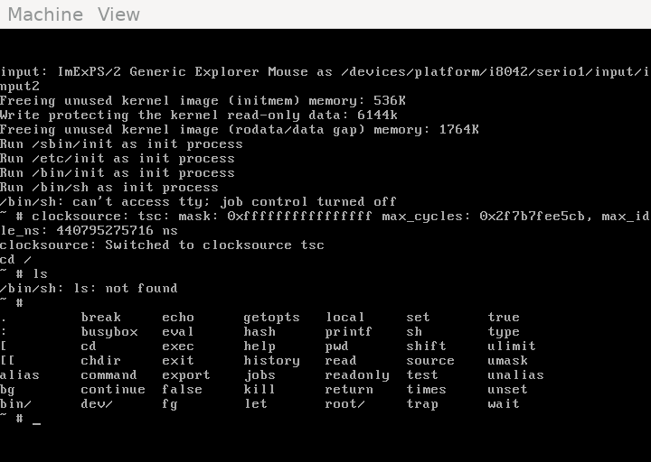

Nice!! We get a shell! Commands like `cd` already work, because they're shell builtins – in the above screnshot, I pressed the tab key twice to show you all shell builtins I could use at that point.

Others, like `ls`, don't work - they are not available in our `PATH` yet. To fix that, I ran `/bin/busybox --install -s`, which created a number of symlinks to the Busybox binary (for example, `/bin/ls`, so `ls` which worked now)!

Busybox also tried to create symlinks in the directories `/sbin`, `/usr/bin`, and `/usr/sbin`, but those didn't exist yet. Creating them using `mkdir`, and re-running the install command helped!

## Writing an init script

Because we'll basically always want to install the Busybox symlinks, how would we go about automating that?

First, instead of creating the required directories after the system had booted, I just directly created them in my `initramfs/` directory.

And for running the install command, how about we write a little init script? I created this as `initramfs/bin/init`:

    #!/bin/busybox sh

    /bin/busybox --install -s

    exec /bin/sh

This file says does three things:

1. The shebang (`#!`) syntax at the top says: "Please run me as a shell script!"
2. Then, it installs the symlinks for all of the Busybox commands.
3. Finally, it replaces itself with a new shell, which the user can type into.

To make this work, I needed to enable "Executable file formats > Kernel support for scripts starting with #!" in the kernel. The `init` file also has to have the executable flag set.

Booting this up in QEMU already felt pretty nice - I could run all kinds of command line tools, including `vi`! However, tools like `df` or `top` still fail:

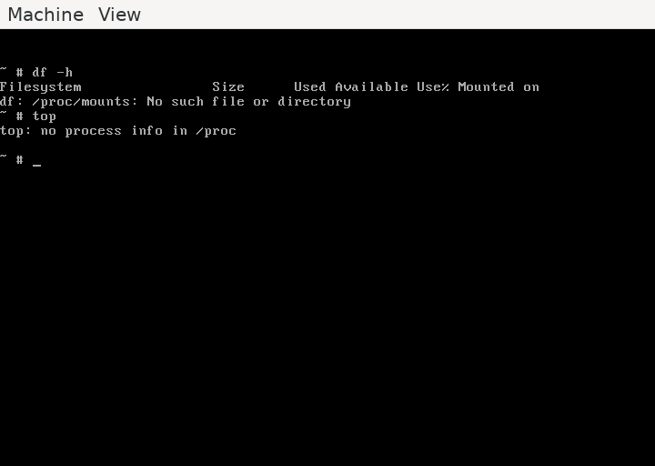

Right, we don't have a `/proc` directory (which provides an interface to some kernel features). How do we get one?

To have a `/proc` directory (and `/sys`, which serves a similar purpose, but is more modern), I had to do two things: First, I had to enable support for them in the kernel ("File systems > Pseudo filesystems > /proc support" & "sysfs support").

And second, I had to mount them. I added these two lines to my `init` script:

    mount -t proc none /proc
    mount -t sysfs none /sys

(Fun fact: You can mount these filesystems into more than one directory at once! Try it!)

## Building an UEFI application

The last thing I wanted to do was to actually boot my tiny Linux system on real hardware.

In the old days, computers used "boot sectors" to determine what to do when they started up. But I'm using a Framework laptop, which doesn't seem to support that style of booting anymore. Instead, it uses UEFI, the "Unified Extensible Firmware Interface". Fortunately, this wasn't as complicated as I had feared, let's get into it!

The first thing I needed to figure out was how UEFI systems boot something. I learned was that they require an "EFI system partition" on the device you want to boot from, a FAT32 partition with a specific ID. On that partition, you put "UEFI applications", basically simple EXE files, which then continue loading the operating system. Usually, you'd have a boot loader like GRUB as an UEFI application, but again, I thought, maybe there was a simpler way?

Turns out Linux has a feature to disguise the `bzImage` *as an UEFI application*, which only does a single thing: Start the kernel! I had a lot of trouble finding this feature in `make menuconfig`. What helped was the search feature: If you type "/", and enter a partial string, it will show you the matching symbols, their positions in the menus, and what they depend on. The symbol I was looking for is called "EFI_STUB", which (as displayed) depends on "EFI", which in turn depends on "ACPI", so I enabled all of those. The locations in the menus are:

- "Power management and ACPI options > ACPI support"
- "Processor type and features > EFI runtime service support"
- "Processor type and features > EFI runtime service support > EFI stub support"

I created a directory called `hda`, to symbolize the contents of my UEFI system partition, and copied the `bzImage` and my `initrd` into it.

### Booting the UEFI application in QEMU

Before actually trying this on my laptop, I wanted to see if this worked in QEMU. By default, QEMU uses an old-style BIOS, but there is an UEFI implementation called "OVMF". I downloaded it using `nix build nixpkgs#OVMF.fd`, and then ran QEMU like this:

    qemu-system-x86_64 -bios path/to/OVMF.fd -hda fat:rw:hda

A neat UEFI console appeared:

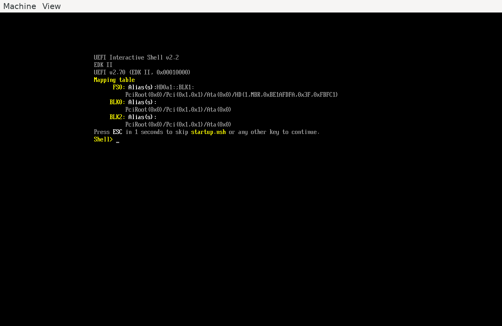

It took me a bit to learn how to use it, but here's the gist:

- `fs0:` to select the correct device
- `ls` shows you the available files
- `bzImage initrd=initrd` to start the kernel, and load the initramfs

The console said "EFI stub: Loaded initrd from command line option", which I guess was a good sign, but didn't show anything else.

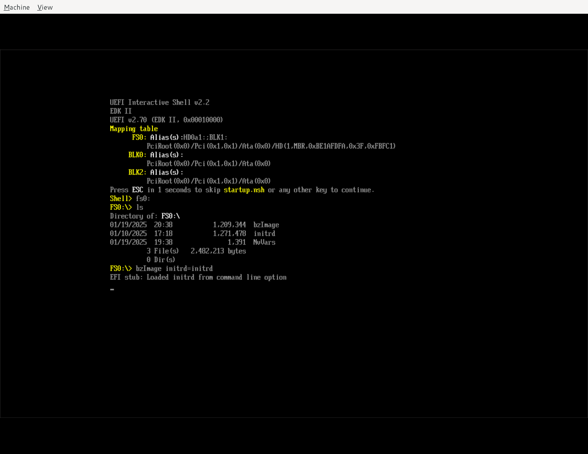

I was stuck on this for a while. With enough googling, eventually I understood that the UEFI shell had put the virtual machine in a different graphics mode (VGA mode), and that we needed to enable framebuffer support in the kernel to be able to display our console there. I needed to activate these three features:

- "Device drivers > Graphics support > Framebuffer devices > Support for frame buffer device drivers"
- "Device drivers > Graphics support > Framebuffer devices > Support for frame buffer device drivers > EFI-based Framebuffer Support"
- "Device drivers > Graphics support > Console display driver support > Framebuffer Console support"

Now, I could boot my tiny Linux in QEMU using UEFI!!

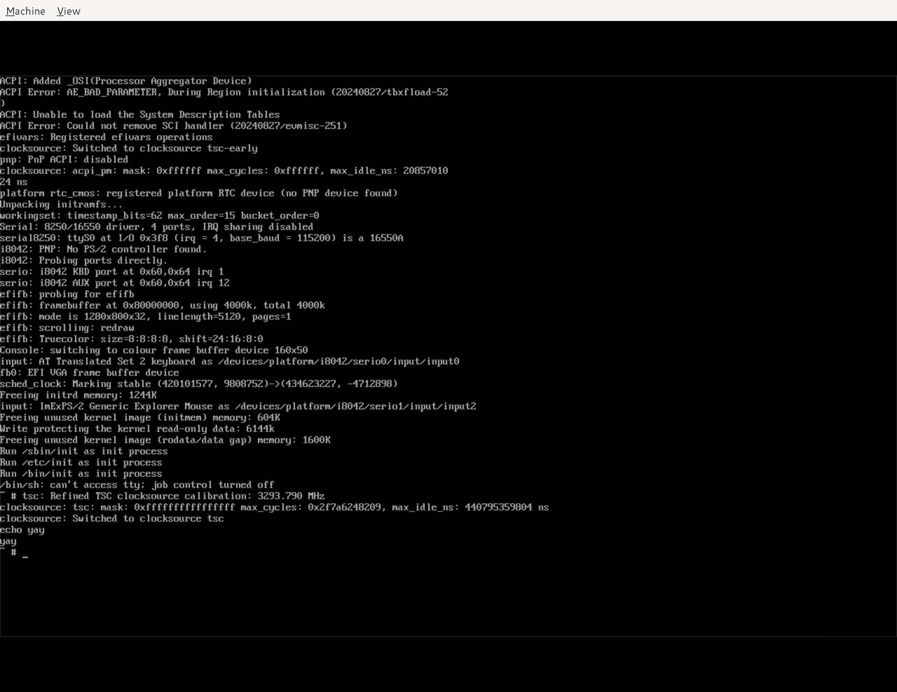

### Preparing a USB stick

Nice! Now that this worked in a VM, I wanted to finally try this on my laptop! I borrowed a USB stick, and, using the `gparted` partition manager, created a single FAT32 partition on it, and gave it the "esp" flag (which sets the correct ID for it to be the EFI system partition). I then copied `bzImage` and `initrd` on this partition, and bravely rebooted!

There was a problem: The Framework laptop didn't give me such a nice UEFI shell like OVMF. I could inspect the partition, and select an UEFI application to boot, but I couldn't provide the required `initrd=initrd` option there!

So what I did was to take the `Shell.efi` from the `X86` directory of the output of `nix build nixpkgs#OVMF`, and put it on my USB stick as well. I rebooted, and entered my laptop's system firmware menu. There, I could select that shell application:

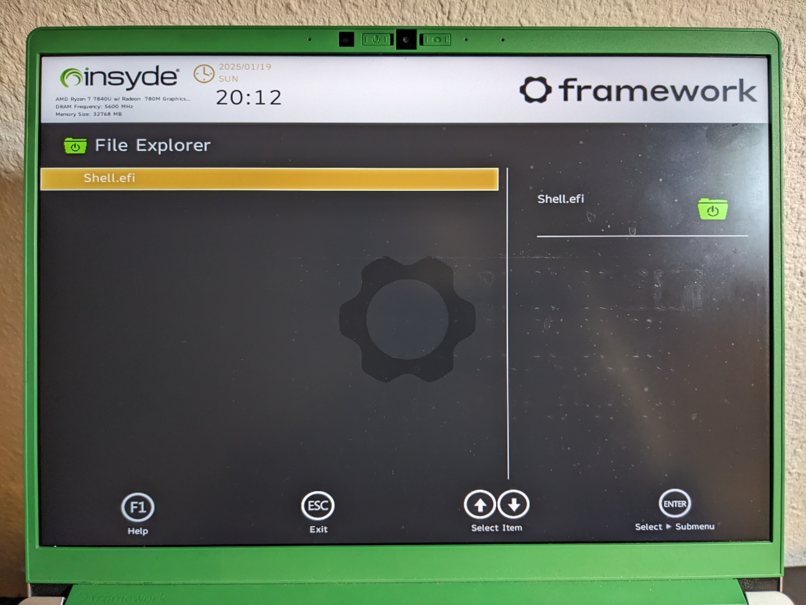

…load the kernel as before…

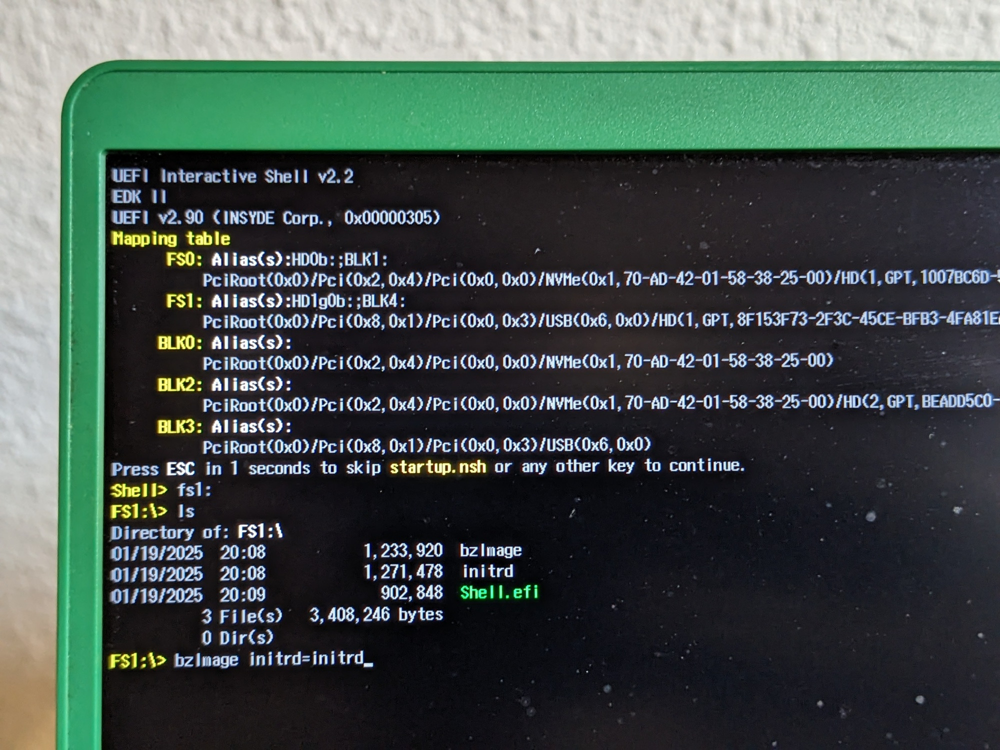

…and happily use my tiny Linux! \o/ *Epic* final celebratory dance! ~(^_^)~

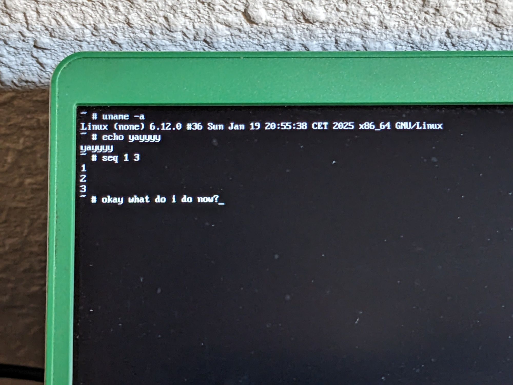

## More things to try

I'm really happy with my "minimal Linux" – it feels like I can put it under a microscope and poke at it! I love that it's so tiny – the bzImage is 1.2 MB, the initrd 1.3 MB.

Right now, trying to do network stuff results in funny error messages:

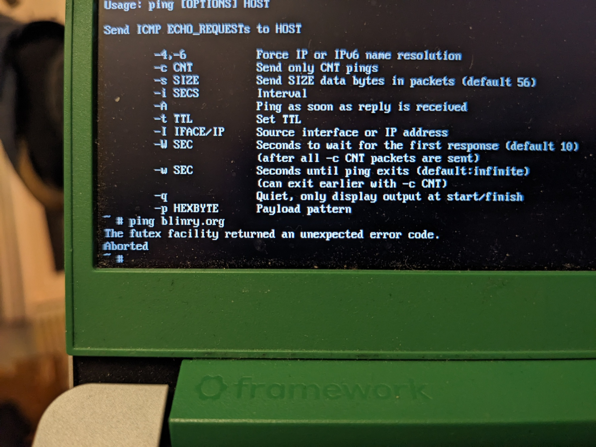

So here are some more things I want to try at some point:

- Connect to the Internet!
- Mount an external partition, to be able to actually persist files.
- Play some audio (would probably involve ALSA?)
- Mount `/dev`? I didn't really need it yet.
- Try to cross compile to 32 bit, to be able to [boot my Linux in a web browser](https://github.com/copy/v86).
- Start adding more software – probably, glibc (the GNU Standard C library) would be important?
- Build my own Linux distribution on top.

If you have more ideas for what to do with it, let me know!

## References

The following articles were helpful for figuring out how all of this works:

- <https://weeraman.com/building-a-tiny-linux-kernel/>
- <https://www.subrat.info/build-kernel-and-userspace/>

## Closing thoughts

Doing this exploration so iteratively was a lot of fun, and is an approach I can really recommend!

I was surprised by the amount on old technology our modern Linux setups are still based – VGA, cpio archives, pretty old C code, FAT32 partitions, PE executables… If someone were to design this from scratch, it think this all might look very differently.

## Discuss this article

- [On Hacker News](https://news.ycombinator.com/item?id=42781923)
- [On Lobsters](https://lobste.rs/s/pyejlx/building_tiny_linux_from_scratch)
