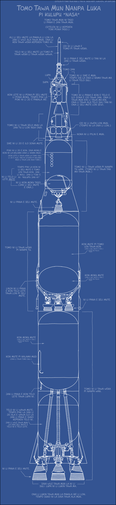

Toki Pona is a minimalist constructed language created by Sonja Lang in 2001. It has around 120 root words and a very small grammar, and you can [learn it](http://tokipona.net/tp/janpije/okamasona.php) in a few hours.

To practice this language, I started to translate some of the "xkcd" webcomics by Randall Munroe, which are published under a [CC BY-NC 2.5](http://creativecommons.org/licenses/by-nc/2.5/) license. To make my life easier, I'm basing my translations on the SVG files of the German translation project [xkcDE](https://xkcde.dapete.net/about/) by Peter Schlömer, released under the same license.

My translations are released under the terms of [CC BY-NC 2.5](http://creativecommons.org/licenses/by-nc/2.5/), as well. The font is [Comic Jens Bold](https://www.kutilek.de/comic-jens/free) by Jens Kutilek, published under [CC BY-ND 3.0](http://creativecommons.org/licenses/by-nd/3.0/), you can download it from [1001 Fonts](https://www.1001fonts.com/comic-jens-font.html).

*mi toki e pakala la sina o pona e ona! musi pona!*

<h2 id="505">505: kiwen mute lili</h2>

Thanks to [jan Ne](https://twitter.com/nena_esun) for proofreading! ([Original version](https://xkcd.com/505/))

<h2 id="1133">1133: tomo tawa mun nanpa luka</h2>

Thanks to [jan Kiki](https://twitter.com/mi_jan_Kiki) for proofreading! ([Original version](https://xkcd.com/1133/))

