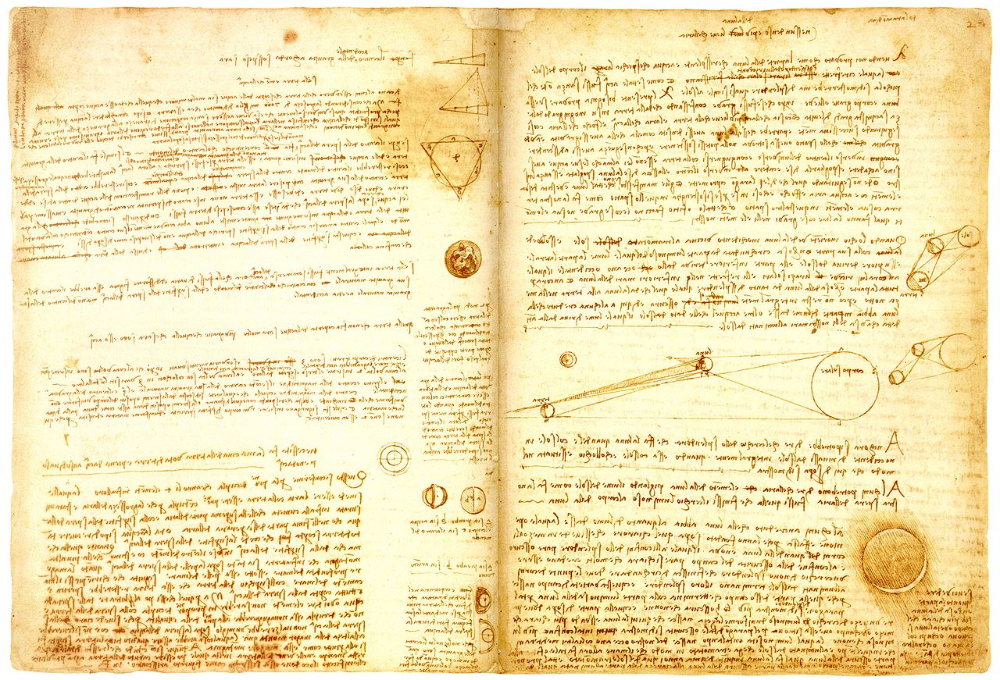

<link href="nordlicht.css" rel="stylesheet">

## Motivation

Given a page of written content, its structure is pretty apparent. You can easily scan the page and read the parts which seem interesting to you. (Unless it's written by Leonardo da Vinci, duh. But you get the idea.)

For a video, this is different. You can't see the structure, because you can only look a single frame at a time.

**For example, try to find the scene where the bomb explodes in the following video:**

<%= youtube("Tx1XIm6q4r4", classes: "nordlicht-none") %> <!-- pals -->

*Did you find it? Was it easy?*

I think it feels a little like stabbing in the dark. The slider at the bottom just seems terribly inefficient to me.

## The solution

I propose adding color information to the slider, to show the *structure* of the video.

**Again, try to find the explosion - but this time, click around in the bar below the video!**

<%= youtube("Tx1XIm6q4r4") %> <!-- pals -->

 *(You find pause and resume the video by clicking it.)*

Here's another example. **Can you find the scene with the elevator?**

<%= youtube("9bZkp7q19f0") %> <!-- gangnam -->

I call user interface elements like these *visual timelines*. Let me show you why they are awesome and how they work!

## Why are visual timelines cool?

There are several cool things which happen when you have a visual timeline to navigate a video.

For example, you can suddenly *see the intro and the credits* of videos:

<%= youtube("R6MlUcmOul8") %> <!-- Tears of Steel -->

... and even if there's a "secret scene" after the credits!

In a recorded talk, you can see *when the slides change*:

<%= youtube("\_QdPW8JrYzQ") %> <!-- Reply to spam email -->

In a talk, you can also *differentiate sections* and *see where the Q&A begins*:

<%= youtube("iQOylPRdDP4") %> <!-- Language Without Code  -->

<!-- You can see ads, and skip them more easily: -->

And sometimes, you can get a feeling for the arc of suspense of a movie, just by looking at the color development:

<%= youtube("GGyLP6R4HTE") %> <!-- Madame Tutli-Putli -->

## How are these images created?

1. Take frames from the video at regular intervals...
2. scale them to a width of 1 pixel, averaging the colors...
3. and append all of them to one single image.

The result gives you an impression of the color development over time, and you can also differentiate between up and down.

There are many other styles of visual timelines which could be interesting. For example, here's one visualizing the audio track of the video, using a *spectrogram*:

<%= youtube("GGyLP6R4HTE", classes: "nordlicht-spectrogram") %> <!-- Madame Tutli-Putli -->

<!-- ## I want you to be unsatisfied!

Imagine having visual timelines

... in Netflix:

... on Vimeo:

... in VLC:

## Is there usable software already?

https://nordlicht.github.io/

## How you can help

Are you a developer working on some kind of video player? Implement visual timelines in your software!

Do you like to watch videos? Be unsatisfied! Demand user interfaces which allow you to see *structure*.

-->

## Footnotes

This work is in the spirit of Bret Victor's essay [Up and Down the Ladder of Abstraction](http://worrydream.com/LadderOfAbstraction/). Visual timelines are an example of an *abstraction over time*.

I take much inspiration from the [Explorable Explanations](https://explorabl.es) community.

## My Story

In early 2011, I came across the [moviebarcode tumblr](http://moviebarcode.tumblr.com/). The people behind it take feature films, and create similar images depicting their color development. I had fun doing quizzes with some friends – we would show each other three of these images, as well as the movie titles in a random order, and the others had to assign the images to the titles. To my amazement, we managed to recognize [Gandhi (1982)](http://moviebarcode.tumblr.com/post/30810242202/gandhi-1982-prints), soley by the black intermission in the middle of the movie.

And that's when I thought "huh, wouldn't it be awesome to use these for navigation"? Now, supported by the [Prototype Fund](https://prototypefund.de/), I'm able to work on this vision properly!
