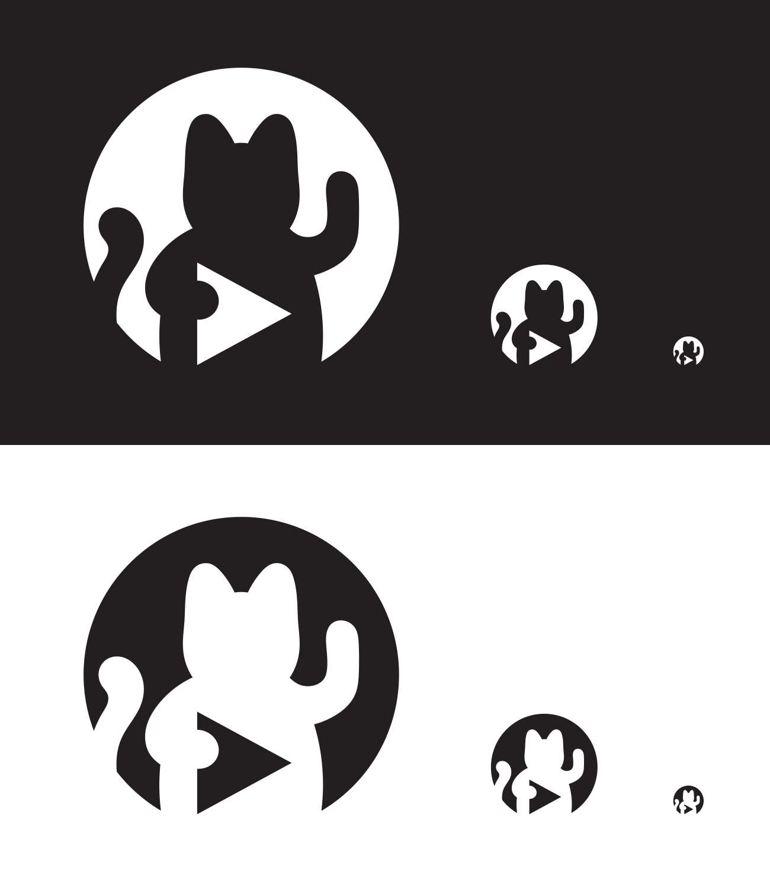

A logo for [media.ccc.de](https://media.ccc.de), the video/audio archive of the Chaos Computer Club and for the [CCC Video Operation Center](https://c3voc.de/) (C3VOC).

It depicts a lucky cat, which has been the mascot of the C3VOC for quite a while: They place lucky cats in the scenes to be recorded for testing purposes, to make sure the video stream did not accidentally freeze.

The visual style is inspired by GitHub's [Octocat mark](https://github.com/logos), and the name *Voctocat* is a word play on that and on the abbreviation "VOC". Thanks to Pecca for [suggesting a tail shape](https://twitter.com/Pecc0r/status/836517783668211712)! :)

Here's an optimized version, suitable for immediate reuse and repursposing:

If you're interested in the logo's development process, you can find some relevant information in the replies to this tweet:

<%= tweet(836367106836946946) %>
