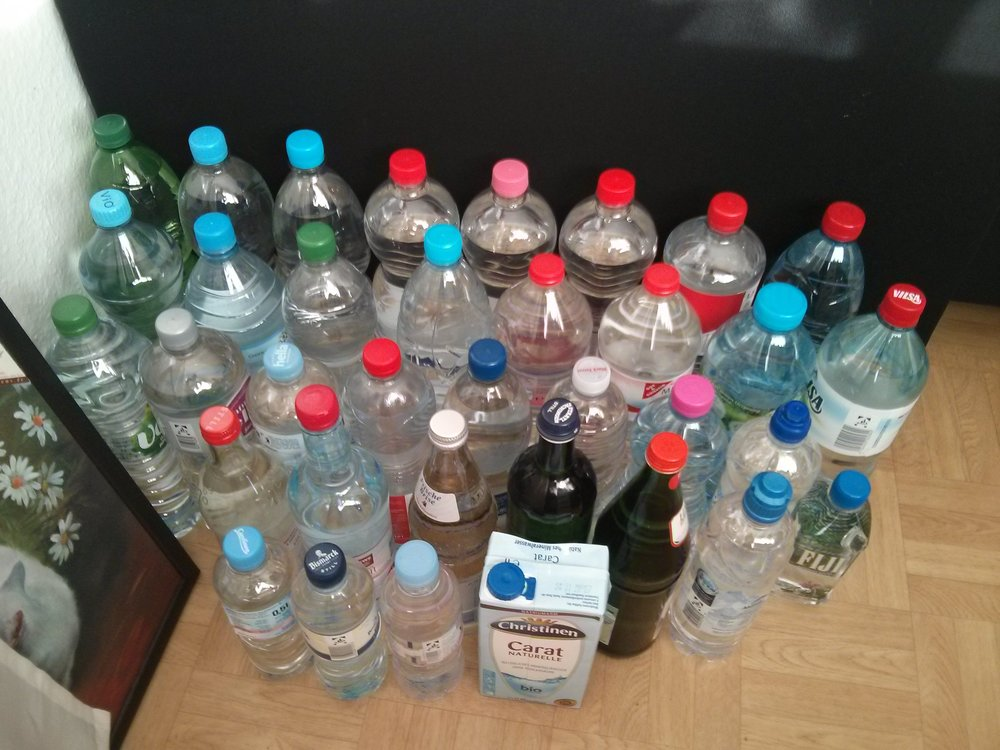
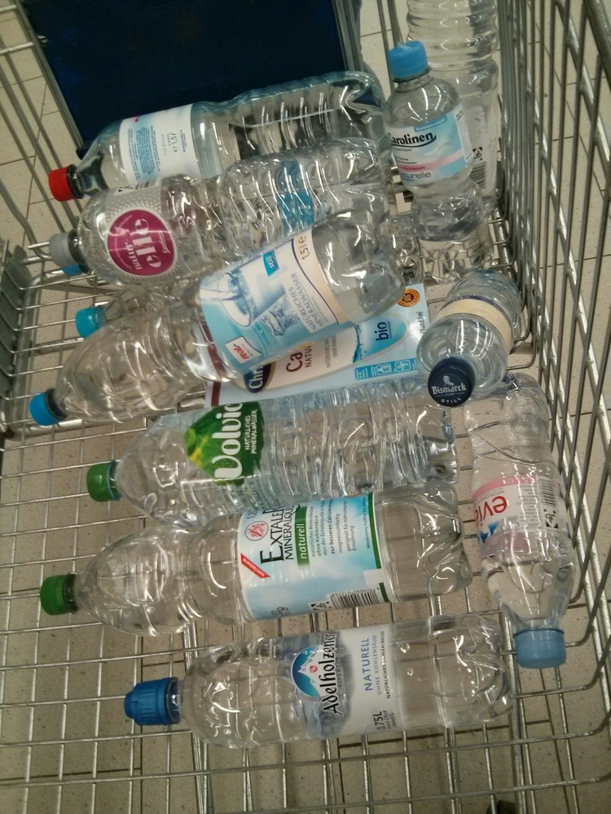
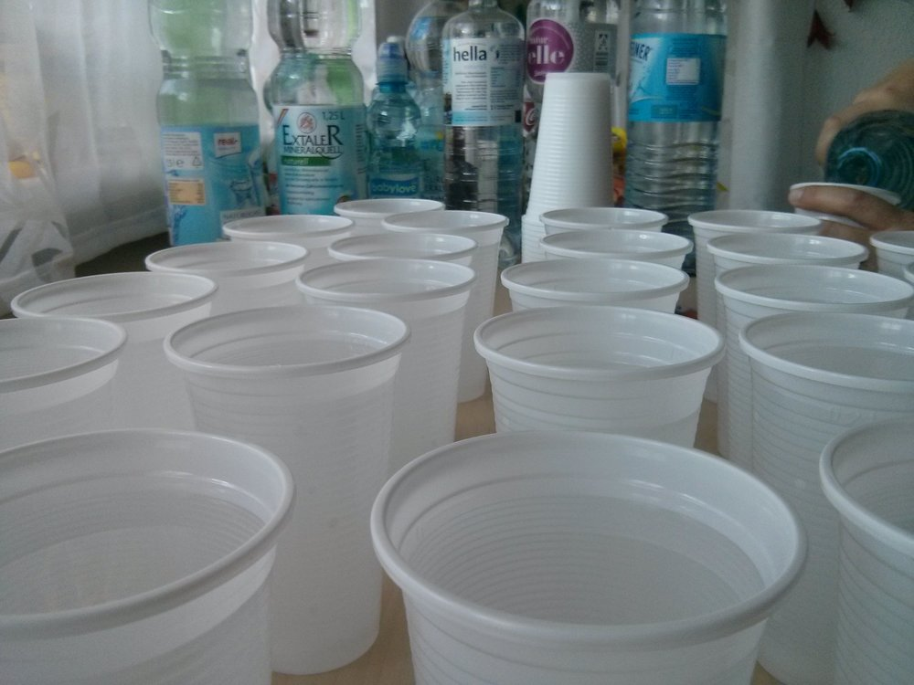
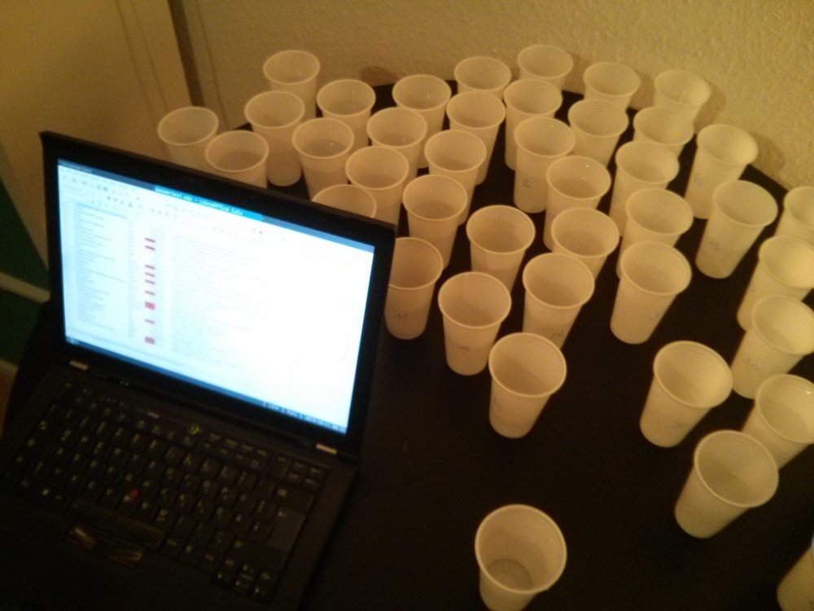
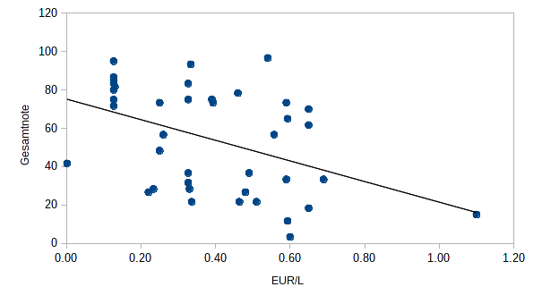
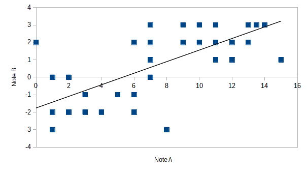

Blindtests sind toll! Ich habe in der Vergangenheit schon Blindtests von Vollmilchschokoladen, [Colasorten](https://twitter.com/blinry/status/287611766458941442) und [Koffeinbrausen](https://twitter.com/blinry/status/537918023206969347) gemacht. Vor einigen Wochen stieß ich dann auf [diesen Tweet von dome](https://twitter.com/0x530302/status/601948917610192896), in dem es um die Verkostung von stillem Wasser ging. Ich beschloss, einen ähnlichen Test durchzuführen, denn ich hatte in Restaurants schon öfter unangenehm salziges Wasser serviert bekommen, und war dementsprechend neugierig darauf, wie groß die geschmacklichen Unterschiede sein würden.

Nach der Durchführung wurden Rufe nach [Open](https://twitter.com/jhisch/status/653148087570034688) [Data](https://twitter.com/tommie_lie/status/653148484770656256) laut, diese Dokumentation ist die direkte Folge.

Noch ein Hinweis: Klar, stilles Wasser in Flaschen ist teuer, produziert Plastikabfall und unterliegt in Deutschland [weniger strengen Kontrollen als Leitungswasser](http://reset.org/act/trinkwasser-aus-dem-rohr-statt-aus-der-plastik-flasche). Wenn nichts dagegenspricht, bleibt bei Leitungswasser! Und nun viel Spaß beim Lesen!

## Fragestellung

Welches stille Wasser ist das leckerste?

## tl;dr

Der Preis von Wasser scheint grundsätzlich invers mit der Geschmacksneutralität zu korrelieren. Anders formuliert: Wenn man Wasser mag, das nach nichts schmeckt, kann man mit den Hausmarken der großen Supermärkte (welche momentan 13 Cent pro Liter kosten) nichts falsch machen.

## Methode

1. Die lokalen Supermärkte nach sämtlichen Marken stillen Wassers abgrasen, die sich finden lassen. In diesem Fall umfasste die Auswahl (tatsächlich, und unbeabsichtigterweise) 42 Sorten, plus das örtliche Trinkwasser.

    

2. Jede Wassersorte in einen eigenen Plastikbecher einschenken, auf dessen Unterseite der Name der Sorte steht.

    

3. Becher mischen, dann zu Buchführungszwecken seitlich auf jeden Becher eine fortlaufende Indexnummer schreiben.
4. Prost! Für jede Wassersorte soviele sensorische Eindrücke wie gewünscht notieren (gustatorische, olfaktorische, ...). Dabei auch die Indexnummer festhalten, und eine Gesamtnote vergeben. Hinweis: Bei 43 Bechern á 200 ml ergibt sich eine Gesamtmenge von 8,6 Litern Wasser, die, sollte man sie auf einmal zu sich nehmen, [definitiv lebensbedrohlich sein kann](https://en.wikipedia.org/wiki/Water_intoxication). Teamwork wird daher empfohlen. In diesem Fall oblag die Durchführung des Tests zwei Personen, Person A und Person B. Person A verwendete ein Schulnotensystem von 0 bis 15 Punkten, während Person B auf einer Skala von -3 (doppelplusschlecht) bis 3 (doppelplusgut) bewertete.

    

5. Optional: Das obere Quartil der Sorten nochmals durchgehen und auf einer höher angesetzten Skala zu differezieren versuchen.
6. Die Auflösung. In der Bewertungstabelle die Indexnummern den Wassersorten zuordnen. Folgenreiche Schlüsse ziehen und die bisherigen Lebensentscheidungen kritisch hinterfragen.

## Resultate

Folgende Liste ist nach einer gemittelten Gesamtbewertung sortiert, die sich als Durchschnitt aus den Bewertungen von Person A und Person B berechnet. Zur Erinnerung: Person A verwendete eine Skala von 0 bis 15, Person B eine Skala von -3 bis 3, die Gesamtbewertung ist in Prozent zwischen 0 und 100 angegeben. In sämtlichen Skalen sind höhere Werte besser.

Sämtliche Ergebnisse sind außerdem auch [im CSV-Format](ergebnisse.txt) verfügbar.

- Christinen Carat (von Real, 0.54 EUR/L): **97%**

    - A: Ganz leicht trocken, sonst nix. (14)
    - B: Nix! (3)

- Surf (von Norma, 0.13 EUR/L): **95%**

    - A: Sehr schön neutral, nicht trocken, richtig gut! (13.5)
    - B: Schmeckt nach nix, frisch (3)

- Nestle Pure Life (von Real, 0.33 EUR/L): **93%**

    - A: Sehr schön neutral (13)
    - B: Bisschen kratzig, ansonsten lecker und neutral (3)

- Elitess Marinius-Quelle (von Penny, 0.13 EUR/L): **87%**

    - A: Alte Pizza, erfrischend-neutral, nicht ganz geschmacklos, mysteriös (11)
    - B: Süß, weich, rund, gut (3)

- Quellbrunn Claudius-Quelle (von Aldi, 0.13 EUR/L): **85%**

    - A: Gar nichts, ganz bisschen trocken (13)
    - B: Frisch und weich, ganz bisschen süß (2)

- Fiji (von Edeka, 3.38 EUR/L): **83%**

    (Hinweis: Dieses Getränk hat einen so starken Geschmack, dass es eigentlich nicht als "stilles Wasser" bezeichnet werden kann. Die Bewertungen sind eher außerhalb der Reihe zu verstehen.)

    - A: Wie Alkohol, aber ohne scharf im Hals zu sein. Igitt. Richtig süß. Nicht für jeden Tag. Lustig. (15)
    - B: Plastik? Gummi? Starker Eigengeschmack, eingeweichtes Gummibärchen (1)

- babylove (von dm, 1.67 EUR/L): **83%**

    - A: Bisschen Geschmack. Eigentlich ganz lecker (10)
    - B: Rein und neutral und weich (3)

- ja! (von Sky, 0.13 EUR/L): **83%**

    - A: Bisschen metallisch (10)
    - B: Wirklich NIX! Erfrischend und weich! Wie ein Quellfluss durch eine grüße Wiese! (3)

- Apollinaris Vio (von Penny, 0.33 EUR/L): **83%**

    - A: Schön neutral, “aber jo weiß ich auch nicht” (10)
    - B: Nix. Nix ist gut. (3)

- Vitalbrunnen Naturalis (von Netto, 0.13 EUR/L): **82%**

    - A: Gar nix (12)
    - B: Ganz leicht metallisch, sonst sehr neutral (2)

- Gut und Günstig (von Edeka, 0.13 EUR/L): **80%**

    - A: Erfrischend. Neutral. Nix. (9)
    - B: Etwas säuerlich, aber sonst nix (3)

- Vilsa (von Real, 0.46 EUR/L): **78%**

    - A: Sauer, trocken, insgesamt neutral und frisch (11)
    - B: Etwas sauer, sonst gut (2)

- Saskia (von Lidl, 0.13 EUR/L): **75%**

    - A: Neutral, bisschen süßlich, gut! (10)
    - B: Bisschen süßlich, nicht besonders erfrischend (2)

- Unser Norden (von Sky, 0.39 EUR/L): **75%**

    - A: Nix. (10)
    - B: Ganz leicht sauer, sonst lecker und weich (2)

- Urstromtaler Naturell (von Netto, 0.33 EUR/L): **75%**

    - A: Charakterlos (10)
    - B: Ziemlich langweilig, neutral (2)

- Black Forest (von Real, 0.59 EUR/L): **73%**

    - A: Erfrischend, neutral (12)
    - B: Sehr süß! Weich (1)

- Vittel (von Penny, 0.39 EUR/L): **73%**

    - A: Sehr sauer (7)
    - B: Ziemlich ziemlich neutral, ganz leicht angenehm säuerlich (3)

- Sawell (von Netto, 0.25 EUR/L): **73%**

    - A: Bisschen süß, bisschen trocken (7)
    - B: Erfrischend, lecker? Gaaanz bisschen süß? (3)

- Tip (von Real, 0.13 EUR/L): **72%**

    - A: Erfrischend, bisschen sauer (9)
    - B: Frisch, leicht metallig aber gar nicht schlecht. Weich. (2)

- Bismarck (von Real, 0.65 EUR/L): **70%**

    - A: Vielleicht süßlicher Geschmack, nicht so erfrischend (11)
    - B: Vorgeschmack süß, Nachgeschmack etwas sauer, interessant? (1)

- Volvic (von Real, 0.59 EUR/L): **65%**

    - A: Pieksig auf der Zunge, unangenehm, schon neutral (7)
    - B: Süß und abgekocht, nichts auf Dauer, aber so ganz erträglich (2)

- Adelholzener (von Real, 0.65 EUR/L): **62%**

    - A: Schwach metallisch, nicht erfrischend (6)
    - B: Süß und recht neutral. Leiiicht oszillierend in alle Richtungen. Spannend. (2)

- Harzer Bergbrunnen extra still (von Real Getränkemarkt, 0.26 EUR/L): **57%**

    - A: Geschmacksneutral, säuerlich (7)
    - B: Etwas scharf, erfrischend, etwas sauer, sonst ohne Eigenschaften (1)

- Magnus (von Edeka, 0.56 EUR/L): **57%**

    - A: Hart, Kalk. Wie das Schwimmbad bei Oma. (7)
    - B: Etwas staubig, kratzt im Hals, sauer Nachgeschmack, sonst angenehm neutral (1)

- Frische Brise Reinbecker Klosterquelle (von Sky, 0.25 EUR/L): **48%**

    - A: Bisschen metallisch (7)
    - B: Leicht abgestanden, metallisch (0)

- Leitungswasser (aus Schleswig-Holstein, 0.00165 EUR/L): **42%**

    - A: Erst neutral, Nachgeschmack RICHTIG EKELIG (0)
    - B: Ein Hauch süß, Baby-Wasser (2)

- Contrex (von Penny, 0.49 EUR/L): **37%**

    - A: Sauer und Stumpf. Könnte nicht viel von trinken. (6)
    - B: Sauer, staubig, schlecht. (-1)

- Aqua Nordic (von Edeka, 0.33 EUR/L): **37%**

    - A: Salzig, metallisch (6)
    - B: Langweilig, neutral, “hart”, Nachgeschmack ist metallisch (-1)

- evian (von Real, 0.59 EUR/L): **33%**

    - A: Bisschen metallisch und trocken, sonst kein Charakter (5)
    - B: Leicht metallisch, kratzig (-1)

- Bleib Gesund (von Rossmann, 0.69 EUR/L): **33%**

    - A: Bisschen trocken, nicht erfrischend, bisschen süßlich. Nicht gut als Wasser. (5)
    - B: Nicht erfrischend, etwas salzig, staubig (-1)

- Vitrex (von Edeka, 0.33 EUR/L): **32%**

    - A: Ih! Sauer, scharf, schmeckt mir nicht (2)
    - B: Staubig, etwas sauer, etwas metallisch (0)

- Real Quality (von Real, 0.23 EUR/L): **28%**

    - A: Sauer, trocken, abgestanden, nicht gut (6)
    - B: Bisschen sauer-metallisch, abgestanden (-2)

- Aqua Mia (von REWE, 0.33 EUR/L): **28%**

    - A: Richtig staubig (1)
    - B: Abgestanden, etwas süß. (0)

- Quellbrunn Werretaler-Quelle (von Aldi, 0.22 EUR/L): **27%**

    - A: Irgendwie süß, schwebt auf der Zunge. Nicht erfrischend genug. (8)
    - B: Ekelig metallisch, bah. Bisschen süß. (-3)

- Harzer Bergbrunnen still (von Real Getränkemarkt, 0.48 EUR/L): **27%**

    - A: Sauer halt (3)
    - B: Stark sauer! Aber nicht uninteressant! (-1)

- Carolinen natur-elle (von Real, 0.46 EUR/L): **22%**

    - A: Total salzig (4)
    - B: Rostnagel, Nachgeschmack ekelig (-2)

- Extaler Mineralquell (von Real, 0.34 EUR/L): **22%**

    - A: Sehr neutral, ganz bisschen säuerlich, bisschen trocken, pritzelt (4)
    - B: Leicht sauer, stark metallisch (-2)

- Hella (von Real, 0.51 EUR/L): **22%**

    - A: Staubig muffig, aber nicht doll (4)
    - B: Stark metallisch, langweilig? (-2)

- Vöslauer (von dm, 0.65 EUR/L): **18%**

    - A: Nicht viel von, metallisch (3)
    - B: Unangenehm metallisch (-2)

- Christinen Naturelle (von dm, 1.10 EUR/L): **15%**

    - A: Saures abgestandenes Mineralwasser. Kohlensäure-Geschmack. (2)
    - B: Sauer mineralwasserig. Bäh. (-2)

- Gerolsteiner (von Edeka, 0.59 EUR/L): **12%**

    - A: Richtig sauer (1)
    - B: Etwas metallisch, etwas sauer (-2)

- Carolinen (von Real, 0.60 EUR/L): **3%**

    - A: Oh! Süüüüß!! Ne, das mag ich nicht in großer Menge. Trocken. (1)
    - B: Ganz starker Eigengeschmack, salzig und metallisch (-3)

- Staatl. Fachingen (von Real Getränkemarkt, 0.96 EUR/L): **(unbewertet)**

    (Hinweis: Dieses Getränk war beim Probieren eindeutig kohlensäurehaltig und wurde deshalb nicht bewertet. Obwohl das Etikett es als "still" auszeichnet, enthält es [laut Homepage](http://www.fachingen.de/staatl.-fachingen-still.aspx) 1.5 g Kohlensäure pro Liter.)

## Auswertung

Offenbar war das Geschmacksideal beider Testpersonen möglichst geschmacksneutrales Wasser. Saure und metallische Geschmacksnoten wurden deutlich abgelehnt, aber auch Sorten mit süßen Unternoten landeten eher im oberen Mittelfeld.

Auffällig ist, dass sämtliche Hausmarken der großen Supermärkte, die momentan für 13 Cent/L gehandelt werden (*Gut und Günstig* von Edeka, *Elitess* von Penny, *Quellbrunn* von Aldi, *ja!* von REWE, *Saskia* von Lidl, *Tip* von Real, *Surf* von Norma, *Vitalbrunnen* von Netto) alle mit Gesamtnoten von mindestens 72% abschlossen.

Auch im Allgemeinen ist im Verhältnis von Preis und Gesamtnote ein Abwärtstrend zu erkennen, wenn man eine Trendlinie über die Daten legt (die preislichen Ausreißer *Fiji* und *babylove* werden in diesem Diagramm nicht berücksichtigt):

Es gab außerdem wenige Sorten, die von den Testpersonen grundsätzlich anders bewertet wurden. Ausnahmen umfassen das Leitungswasser, das von Person A mit 0 und von Person B mit 2 Punkten bewertet wurde, sowie das *Quellbrunn Werretaler-Quelle*, das von Person A mit 8 und von Person B mit -3 Punkten bewertet wurde:

## Methodenkritik

Zuletzt noch einige Anmerkungen, welche die Testdurchführung betreffen, und die bei der Nachahmung dieses Versuches hilfreich sein sollen.

Plastikbecher sind dünnwandig [citation needed]. Bei dieser Durchführung wurde nicht bedacht, dass man potentiell in der Lage sein würde, die auf dem Boden stehende Sortenbezeichnung beim Trinken (spiegelbildlich) zu lesen. Es wird eine weitere Indirektionsstufe in Schritt 2 empfohlen: Eine Tabelle der Sorten aufstellen, diese zufällig sortieren, ihnen jeweils eine Nummer zuordnen, und *diese* dann vor dem Befüllen auf den Boden schreiben. Bei dieser Durchführung wurde dieser Defekt durch die Technik "nicht Hingucken" ausgeglichen.

Die Geschmacksbeurteilung wurde bei dieser Durchführung unstrukturiert in einem Freitextfeld durchgeführt, da uns zu Beginn des Tests keine Kriterienliste vorlag, mithilfe derer die Bewertung strukturiert hätte werden können. Nach Abschluss des Tests empfehlen wir, folgende geschmackliche Aspekte getrennt festzuhalten, um eine differenziertere Beurteilung zu erlauben:

- Säure
- Süße
- Salzgehalt
- Metallgehalt
- Härte
- Sonstige Geschmacksnoten

Ganz sicher fand bei dieser Durchführung durch die gemeinsame, gleichzeitige Verkostung eine gegenseitige Beeinflussung der Testpersonen statt. Dies wurde hier bewusst in Kauf genommen. Wem exakte, unabhängige Ergebnisse wichtiger sind als die Gestaltung des Tests als soziales Event, dem sei statt einer parallelen Verkostung eine serielle empfohlen.

## Schlussworte

Wir wären sehr daran interessiert, wie reproduzierbar unsere Ergebnisse sind. Insofern ergeht der Aufruf an alle Leser, diesen Blindtest -- gegebenenfalls in kleinerem Stil, mit bekannten oder leicht zugänglichen Wassersorten -- zu wiederholen!

Bei der bisherigen Auswertung haben wir uns auf die rein subjektiven Geschmacksbewertungen beschränkt. Eine weitergehende Inbezugsetzung der Geschmacksurteile und der Mineralstoffkonzentrationen in den Wassersorten wäre interessant und ist in Planung.

Schließlich an dieser Stelle nochmals herzlichen Dank an die nicht namentlich gennante Testperson für tatkräftigen und moralischen Beistand und die professionelle wissenschaftliche Betreuung.
