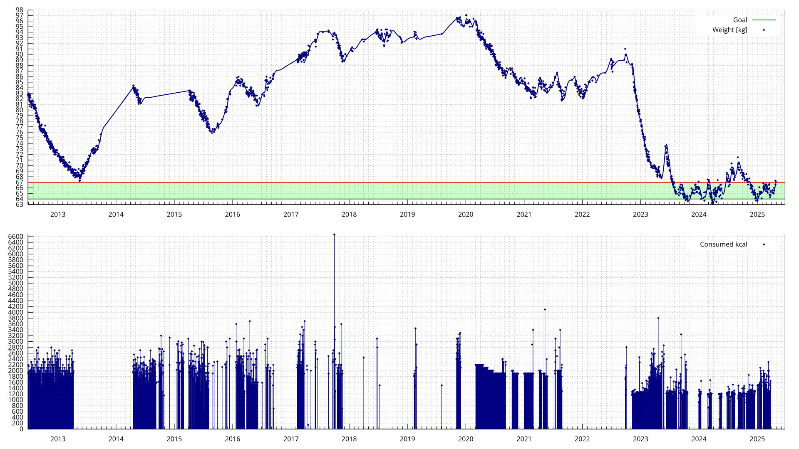
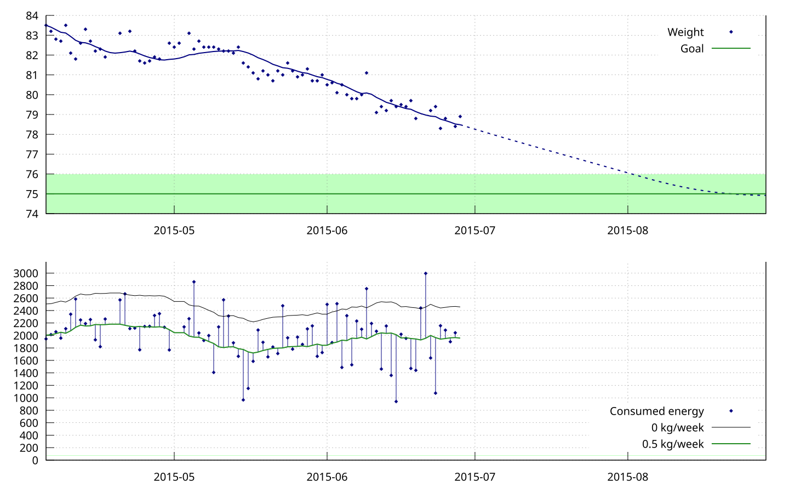
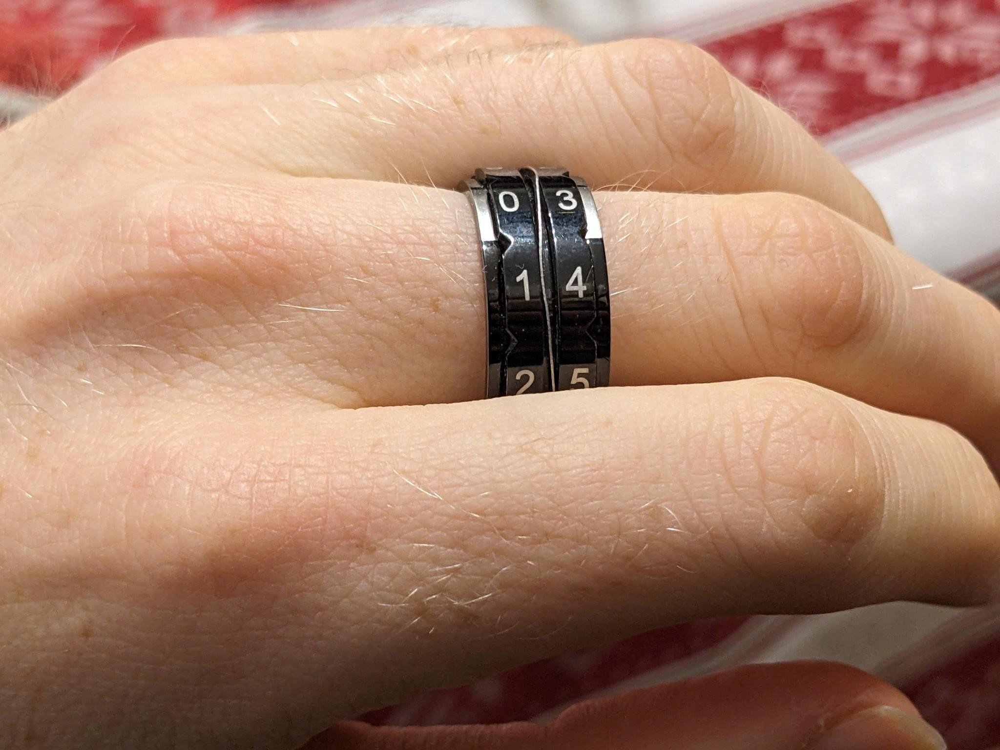

In this post, I describe various techniques I have used for weight loss over the past years – many of them aim at creating a calorie deficit. If you want to lose weight, you might find a trick here that you like!

## Story

In the summer of 2012, I decided that I wanted to lose weight. I had been more or less overweight throughout my school years and wanted to change that. At the time, I found the text [*The Hacker’s Diet*](https://www.fourmilab.ch/hackdiet/), which described a very engineering-style approach to weight loss: You count the calories you eat, record how your weight changes, and build a feedback loop from that, like a technical control system. Controlling food intake was the primary tool in this method – it’s much easier to not eat a donut than to exercise for an hour (which absolutely proved true in practice).

Over the years, I tried many techniques and tricks that helped me lose weight. In this article, I want to share the best of them!

Here's the big picture: I have data since 2012. The hightest I've ever weighted was at the end of 2019, at almost 100 kg. Currently, my weight is about 67 kg.

## Motivation

In 2022, a friend recommended the book *Fettlogik Überwinden* (also available in English: *Conquering Fat Logic*) by Nadja Hermann (who I knew from the web comic *Erzaehlmirnix*), which offers a refreshingly scientific perspective on weight loss and obesity. I find the title confusing, but with "fat logic", Hermann refers to irrational justifications of being overweight. I had two main insights from it:

The first thing I took away from the book was the strongest motivational boost for losing weight I had ever experienced. For example, it mentioned the following studies on the health risks of being overweight:

- *Years of life lost and healthy life-years lost from diabetes and cardiovascular disease in overweight and obese people: a modeling study* (Grover 2015) determined that if 20–39-year-old non-smoking men are overweight (BMI 25–30), they lose an average of 3–6 years of life compared to those who are not overweight. Plus, they lose 6–9 healthy life-years. I found that very striking.
- *Body-Mass Index and Mortality among 1.46 Million White Adults* (Gonzales 2010) stated that white men who never smoked, who had a BMI of 28 (which was my BMI at the time), had a 20% increased risk of dying, compared to those with a BMI of 18-24.

## 1000 kcal deficit

The second insight from *Conquering Fat Logic*: Until then, I had always aimed for a 500 kcal deficit. Hermann described in the book that overweight people can absolutely aim for 1000 kcal deficits per day or more – after all, the body's fat reserves are exactly there to balance out such phases. I tried this out in 2022/2023 and had good experiences with it.

Using various techniques, you can estimate your energy needs. I landed at about 2200 kcal, and with a 1000 kcal deficit, I aimed at eating 1200 kcal per day.

That's really very little. I usually cook for myself, which lets me control how much energy is in my meals. A typical day looked like this:

- A small portion of cereal or a sandwich for breakfast.
- For lunch, cook something with lots of low-calorie vegetables and a protein (tofu, seitan, legumes, etc.). (Soups also work very well!) Use just a few tablespoons of oil, and no starchy side dishes. Eat half the plate for lunch.
- Eat the other half for dinner.
- Then sometimes there were a few calories left, which I used to eat some candy as a reward :3

At first, I was very hungry in the evenings, but after a few days I usually got used to it. Eating so little was surprisingly easy for me. I found it similarly hard to eat 1200 kcal per day as 1600 kcal per day, but with the former, weight-loss phases were simply over faster.

## `nom`

In 2014, I wrote [a software tool](https://github.com/blinry/nom) that can draw pretty graphs of how much you eat and how your weight changes.

You can, for example, type `nom 65.5` in the command line to enter a weight measurement, or `nom sandwich 320` to record that you ate something. `nom plot` then generates an output like this:

By now, I don't record the individual food items in `nom` anymore, but I still use it to track my weight and draw pretty graphs.

## Cronometer

To count calories with an app, I highly recommend [Cronometer](https://cronometer.com). It comes with a large food item database, and the free features have always been enough for me. You can not only track the calories you eat during the day but also your protein intake – which was sometimes important for me during stronger weight-loss phases.

I wrote a script called [`cronometer-to-nom`](https://github.com/blinry/cronometer-to-nom) that converts a Cronometer data export to `nom`'s input recording format.

## Counter ring

Instead of using an app or software for calorie counting, I looked for a technique that was lower threshold and simpler: I got myself a "counter ring" that can display numbers from 0 to 100. It's actually intended for counting stitches when knitting, but it works wonderfully for counting calories too. (The brand is called *KnitPro*.)

If you're interested in getting one, I modelled a [3D-printable one](/counter-ring/) back in 2020.

## Calorie quantization

In various contexts, I found it helpful not to think about individual kilocalories but to group them into small "packages." Initially, I used hundred-calorie packages (and called the unit "points"), but now I think steps of 50 kcal are just right. I call this unit (because I count it with the counting ring) "rings."

A slice of bread has about 2 rings. A banana as well, as does a tablespoon of oil. A piece of chocolate or a teaspoon of peanut butter has 1 ring. And so on. Over time, I got these numbers pretty well into my head, which also made it easier when cooking to decide what ingredients to use.

## Free vegetables

Starting in 2024, I experimented with treating low-calorie vegetables as "free," meaning I don't track them – I can eat as much as I want.

This includes most vegetables. Exceptions are plants that have a lot of calories relative to their weight, like potatoes, legumes, or avocado.

Later, I added protein shakes as another "free category." It seems like a good incentive to consume more of them. I found that I don't really "fill up" on them – I just drink one per day.

## Accountability

It helped me a lot to report publicly about my weight loss – I write irregular updates on Mastodon, showing my graphs. Sometimes I keep that a bit in mind, and it helps me stay consistent.

In 2022, I did a "monthly challenge" to eat a different vegetable every day and post photos of it. That helped me get into a mindset of how diverse, colorful, and tasty vegetables really are!

And at the beginning of the 1200 kcal period, I wrote a [daily thread](https://chaos.social/@blinry/109325500592045027) about whether I had stuck to it and converted the energy into fun comparisons, like "with the energy I ate today, I could have charged my smartphone 92 times."

## Target band

What is the "goal" of my weight loss? In scientific literature, I found ideal BMI ranges of 20–25, 23–25, 20–22. I found it exciting to try a BMI of 20, which for me is 64.8 kg.

Thus, I defined a "target weight band" where I would like to stay long-term, from 64–67 kg. In my nom graphs, this is always marked in green. After reaching 64 kg in 2023, I made a deal with myself: if I move out of the upper end of the band, I will track calories until I reach the lower end again.

## Rewards

As additional motivation, I sometimes promised myself rewards: "When I first reach 64 kg, I'll buy myself a new water kettle."

Or, more recently: "If I manage to stay within the band for three months, I can buy myself a new fountain pen." That was very effective – after several attempts, I achieved it for the first time in March 2025!

## Penalties

Fairly early on, I tried the following deal with a partner: "If I weigh more than X kg on a set date, you get 100 EUR from me for each excess kg". That was very frustrating because I didn’t feel like I could directly influence my weight enough. In the end, I paid quite a bit ^^'.

Instead of such "output-oriented" goals, I would much more recommend "input-oriented" agreements, focusing on what you can directly control – the calories eaten per day.

## Exercise

I always added the calories I burned during exercise to my daily allowed calories. Cronometer often helped me estimate how many calories it was (many online calculators seem to overestimate). For example, jogging 5 km at an easy pace seems to correspond to about 150 kcal.

This was a pretty good incentive to exercise – I always enjoy being allowed to eat a little more for it!

## Potatoes

...

## Outlook

Currently, I'm in a phase where I don't count calories. If I were to do it again, which techniques would I use? Here's what I think:

- I would use a [counter ring](#counter-ring), twist it to 24 in the morning (to signify 24 available 50-kcal-packages), and track what I eat until I hit 0.
- I would insert my weight data TODO

Note that some of the techniques I've described here might not work well for you.
