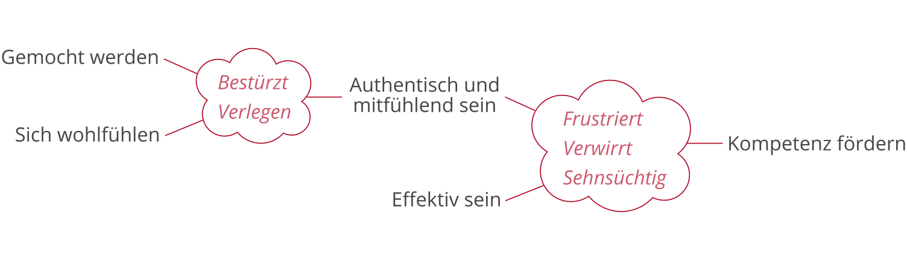

*Dies ist eine Übersetzung von [Joe Edelmans](http://nxhx.org/) Essay
[When Wisdom Comes](https://medium.com/@edelwax/what-are-feelings-d54a741ea134),
das mich sehr berührt und geprägt hat. Wenn ihr könnt, lest das Original!*

*Herzlichen Dank an [rixx](https://cutebit.de), [Pecca](https://twitter.com/pecc0r) und Wolfgang für's Korrekturlesen! <3*

---

Gefühle werden oft missverstanden. Sogar von Psychologen, Philosophen und
Neurowissenschaftlern und sicherlich von Designern und Aktivisten.

Ich werde zunächst beschreiben, *wie Gefühle in uns wirken*. Daraus ergeben
sich Definitionen von *Integrität* und *Weisheit*. Ich werde die Frage stellen,
ob sich die Weisheit *im Niedergang befindet*, und Antworten finden, die mit
*Organisationen* und *Bürokratien* zu tun haben. Und schließlich werde ich
betrachten, wie man *anderen* im Blick auf ihre Gefühle und Werte *helfen*
kann.

## Wie Gefühle in uns wirken

Dies ist die Grundidee:

> *Jedes Gefühl ruft uns etwas in Erinnerung, das uns wichtig ist.*

Zum Beispiel:

- **Wut** verrät uns, dass etwas, das uns wichtig ist, *blockiert* ist
- **Angst**, dass etwas, das uns wichtig ist, *bedroht* ist
- **Scham**, dass wir etwas, das uns wichtig ist, *nicht gerecht geworden sind*
- **Verwirrung**, dass uns *die Vorstellung von etwas fehlt*, das uns wichtig ist
- und so weiter

Wir lernen durch unsere Gefühle, *was uns wichtig ist*. Sie verraten uns unsere
*Werte*.

Gefühle helfen uns außerdem, unseren Umgang mit unseren Werten zu überprüfen.
Positive Gefühle erinnern uns daran, zu *begrüßen* oder *wahrzunehmen*, was uns
wichtig ist. Negative Gefühle hingegen tun mehr: Ein negatives Gefühl
signalisiert einen Konflikt zwischen unseren Werten, über den wir nachdenken
sollten:

- Vielleicht haben wir nach Wert B gestrebt, dabei aber Wert A vergessen. Ich
  habe früher zum Beispiel versucht, *effektiv* zu sein, dabei aber vergessen,
  dass es mir auch wichtig war, *freundlich* zu sein. Das könnte zu
  *Betretenheit* führen.
- Oder wir vernachlässigen vielleicht Wert B, weil wir es für unmöglich halten,
  beide zu verfolgen. Ich könnte es zum Beispiel für unmöglich halten,
  gleichzeitig *meinem Interesse nach kreativer Arbeit* nachzugehen, während
  ich *meine Familie finanziell unterstütze*, aber beides ist mir wichtig. Das
  führt vielleicht zu *Frustration* oder *Sehnsucht*.

Es gibt viele weitere Arten von Konflikten. Zum Glück haben wir aber Gefühle,
die uns mitteilen, dass wir uns mit diesen Konflikten auseinandersetzen müssen,
anstatt sie einfach zu übergehen. Die Gefühle erinnern uns daran, uns selbst
Fragen zu stellen wie:

- Kann ich freundlich *und* effektiv sein?
- Halte ich *wirklich* viel davon, effektiv zu sein, oder ist es vielleicht
  *immer wichtiger* für mich, freundlich zu sein?
- Ist es *wirklich unmöglich*, kreativer Arbeit nachzugehen und gleichzeitig
  meine Familie finanziell zu unterstützen?
- Was *würde tatsächlich passieren*, wenn ich aufhören würde, meine Familie
  finanziell zu unterstützen?

Oft wollen wir uns diese Art von Fragen nicht stellen. Aber die Gefühle kommen
weiter in uns auf, bis wir es tun. Bis wir uns die Zeit nehmen, all diese
Konflikte so gut es geht zu lösen, gibt es eine Diskrepanz zwischen dem, was
wir leben, und dem, was uns wichtig ist. Diese Diskrepanz führt dazu, dass wir
nicht stolz darauf sein können, wer wir sind. Um uns selbst und unsere
Entscheidungen akzeptieren zu können, müssen wir uns mit den Konflikten
auseinandersetzen.

## Besitzt du Integrität?

Oft scheitern wir daran, die Botschaften unserer Gefühle zu empfangen. Dafür
kann es drei Gründe geben:

- **Verdrängung**. Wenn eine Person sich ihrer Gefühle nicht bewusst ist oder
  es sich nicht erlaubt, sie zu spüren, werden die Gefühle *verdrängt*.
  Verdrängte Gefühle können völlig verschwinden. Man wird *abgestumpft*,
  *depressiv* oder *ängstlich*.
- **Dampf ablassen**. Andere Leute *spüren* ihre Gefühle, nehmen sie aber nicht
  ernst als Botschafter dessen, was wichtig ist. Die Gefühle kommen immer
  wieder zurück und die Person wird *melodramatisch*.
- **Vermeidung**. Eine dritte Gruppe schafft den ganzen Weg bis hin zur
  Erkenntnis, was ihnen wichtig ist, setzt sich aber nicht mit den aufgedeckten
  Konflikten auseinander und löst sie auch nicht. Diese Leute werden dauerhaft
  *hilflos*, *konfliktbehaftet*, *verwirrt* und *realitätsfern* sein.

Du kannst diese Probleme vermeiden, indem du die Situationen in deinem Leben
*ganz zu Ende fühlst*, angefangen bei den Emotionen, und endend mit einer
Vereinbarung von Werten:

> *Fühlen* → *Wertschätzen* → *Sich auseinandersetzen* → *Vereinbaren*

Eine Person, die *alle* ihre Situationen zu Ende gefühlt hat, besitzt
*Integrität*. Sie ist *geerdet*. Integrität bedeutet, dass sie weiß, was ihr
wichtig ist, und dass sie sich mit allen Konflikten auseinandergesetzt hat.

Zu Integrität zu kommen ist am einfachsten, wenn sich deine Situation langsam
ändert: Dann hast du viel Zeit, um deine Gefühle wahrzunehmen, um
herauszufinden, was dir wichtig ist, und um dich mit möglichen Konflikten
auseinanderzusetzen.

## Und wie ist es mit Weisheit?

Je dynamischer dein Leben ist -- je größer die Vielfalt an Leuten und
herausfordernden Situationen ist, mit denen du jeden Tag umgehst -- desto
schneller musst du im *zu Ende fühlen* sein. Die wichtigste Fähigkeit für
Führungspersonen ist es, schnell darin zu sein, Dinge zu Ende zu fühlen. Eine
solche Person ist *lebenserfahren* oder *weise*.

Es ist leicht zu erkennen, ob eine Person weise ist: Sie spricht klar und
deutlich über ihre Gefühle und Werte und darüber, wie sie sich in verschiedenen
Situationen mit ihren Werten auseinandergesetzt und diese miteinander
vereinbart hat.

Sie ist außerdem kreativ. Eine weise Person lenkt ihr Leben und ihre soziale
Aktivität in ungewöhnliche, kreative Richtungen. Sie hat Werte, die nur durch
die Auseinandersetzung mit Konflikten entdeckt werden können.

Hier ist ein Beispiel:

- Früher habe ich versucht, von Leuten *gemocht zu werden*. Aber irgendwann
  erkannte ich, dass dies mit meinem Wert, *mich wohlzufühlen*, im Konflikt
  stand. Ich merkte, dass ich angespannt und unecht war, um gemocht zu werden.
  Ich fühlte mich *bestürzt* und *verlegen* und das half mir, mich dafür zu
  entscheiden, nicht darauf aus zu sein, gemocht zu werden, sondern stattdessen
  zu versuchen, *authentisch und mitfühlend zu sein*.
- Später kam mein neuer Wert, *authentisch und mitfühlend zu sein*, in Konflikt
  damit, *effektiv zu sein*. Ich merkte, dass ich lieblos war, wenn ich Gruppen
  dazu drängte, effektiv zu sein. Mich *frustriert* und *verwirrt* zu fühlen,
  ermutigte mich dazu, das aufzulösen. Ich entwickelte eine neue Sicht auf
  Effektivität, die darauf abzielt, *Kompetenz* in mir und anderen zu fördern.

In beiden Fällen behob der Übergang von alten zu neuen Werten
einen Denkfehler:

- Als ich es aufgab, *gemocht zu werden*, erweiterte sich meine Vorstellung von
  *guten Beziehungen*.
- Als ich es aufgab, *effektiv zu sein*, korrigierte ich ähnliche falsche
  Vorstellungen von *guten Teams*.

Ich konnte die alten Werte deshalb aufgeben, weil ich geklärt hatte, was sie
*wirklich für mich bedeuteten*. Die Bedeutsamkeit der alten Werte ging völlig
in dem neuen, *umfassenderen*{:.underline} Wert auf.

Diese mächtigen neuen Werte und Perspektiven resultieren aus negativen
Gefühlen. Ohne unsere Gefühle würden wir auf primitiven Werten wie *gemocht
werden* und *effektiv sein* hängenbleiben.

## Ist Weisheit im Niedergang?

Ich glaube, dass all dies -- Gefühle, Werte, deren Vereinbarung -- Teil der
menschlichen Natur ist, genau wie Sprache oder Gebärden. Aber viele von uns
haben das aus dem Blick verloren. Wenn Gefühle natürlich sind, warum ist das
Wesen von Gefühlen dann so undurchschaubar?

- *Auf das Individuum bezogen*, warum verwirren uns Gefühle und Werte?
- *Auf die Gesellschaft bezogen*, warum ist diese Verwirrung so verbreitet?

### Wie Individuen sich verwirren lassen

Unsere Fähigkeit, Dinge *zu Ende zu fühlen*, ist Angriffen ausgesetzt. Zum
Einen arbeiten verbreitete *kulturelle Mythen* daran, uns hinsichtlich der
Funktionsweise von Gefühlen und Integrität zu verwirren. Und zum Anderen lassen
*falsche Annahmen* unsere Werte unvereinbar erscheinen.

**Kulturelle Mythen**. Es gibt verbreitete kulturelle Missverständisse zum
Thema Gefühle:

- Einer dieser Mythen ist die stoische Person -- üblicherweise ein Mann -- die
  irgendwie weiß, was ihr wichtig ist, und die ihre Werte vereinbart, ohne
  dabei jemals ihre Gefühle zu spüren. Der Mythos ist, dass sie einfach auf
  magische Art und Weise eine *höchst effektive Person* ist.

- Ein anderer Mythos ist die hysterische Person -- üblicherweise eine Frau --
  deren Gefühle nichts darüber aussagen, was ihr wichtig ist. Der Mythos ist,
  dass sie einfach *ihren Mann stehen*, *unnachgiebig bleiben* oder *Gleichmut
  entwickeln* muss.

Die dominierenden Ansätze der klinischen Psychologie unterstützen und fördern
diese Mythen: Die stoische Sichtweise wird von *kognitiver Verhaltenstherapie*
und *Lebensberatung* unterstützt, während die hysterische Sichtweise von
verschiedenen *Karthasis-Therapien* bzw. *künstlerischen Therapien*, von
*Achtsamkeitstraining*, von manchen Formen der *Familientherapie* und von
*Co-Counseling* gefördert wird.

**Falsche Annahmen**. Kulturelle Mythen unterbrechen den Prozess, zu fühlen
oder zu erkennen, was wichtig ist. Unsere Kultur ist außerdem voller falscher
Annahmen, die Werte unvereinbar erscheinen lassen. Annahmen wie:

- Wenn ich *sage, was ich wirklich will*, werde ich *sozial ausgestoßen*.
- Ich bin ein *schlechtes Elternteil*, wenn ich *irgendetwas für mich selbst
  will*.
- Es ist nicht möglich, als *Künstler* seinen *Lebensunterhalt zu verdienen*.
- Solange ich *ehrlich* bin, muss ich nicht *freundlich* sein.
- Ich kann nicht *verführerisch* sein, ohne *manipulativ* oder *übergriffig* zu
  werden.

Wenn du einer solchen falschen Annahme unterliegst, ist es dir nicht möglich,
dich mit einem Wertkonflikt auseinanderzusetzen und ihn aufzulösen. Die falsche
Annahme sagt dir, dass eine Auflösung unmöglich ist. Welches Gefühl auch immer
den Prozess ausgelöst hat (zum Beispiel *Scham* darüber, nicht freundlich zu
sein, *Aufregung* darüber, verführerisch zu sein, oder ein *Verlangen* nach
kreativem Ausdruck), es verwandelt sich in Verzweiflung, bevor du die Chance
hast, dich mit dem Konflikt auseinanderzusetzen.

Wenn du die falsche Annahme findest und sie hinterfragst, kannst du den
Konflikt auflösen.

### Warum die Gesellschaft auf Verwirrung ausgelegt ist

Wenn also diese kulturellen Mythen und falschen Annahmen auf individueller
Ebene so schlecht für uns sind, warum sind sie so verbreitet? Hier ist meine
Vermutung: Sie haben Menschen berechenbarer gemacht und sie in bessere Rädchen
im sozialen Getriebe verwandelt.

Im Laufe der letzten 300 Jahre sind Organisationen, Bürokratien und
Institutionen immer komplexer geworden. Um stabil zu bleiben, brauchten sie
vorhersagbare Entscheidungen der Menschen in ihnen.

Eine Person ist einfacher zu kontrollieren, wenn sie nicht gut im *zu Ende
fühlen* ist und wenn sie glaubt, dass ihre Werte *unvereinbar* sind. Sie wird
ein besserer Konsument und (zumindest in einer Bürokratie) ein besserer
Produzent.

Die erfolgreichsten Subkulturen wären also diejenigen mit kulturellen Mythen
und falschen Annahmen. Und wenn Leute darauf getrimmt werden, effektiv zu sein,
werden diese kulturellen Mythen und falschen Annahmen verstärkt.

Das würde ein Muster erzeugen, das wir heutzutage sehen: Je erfolgreicher eine
Gruppe ist, desto verwirrter ist sie im Blick auf Gefühle und Weisheit.

## Anderen helfen

Erwarte fürs erste also, von Leuten umgeben zu sein, die schlecht im *zu Ende
fühlen* sind, die nicht *lebenserfahren* oder *weise* sind, und die tief in
*kulturellen Mythen* und *falschen Annahmen* verstrickt sind. Das wird so
bleiben, bis Organisationen und Institutionen anders funktionieren.

Aber du kannst den Menschen, die dir nahe stehen, helfen:

- Wenn sie Probleme damit haben, ihre Gefühle wahrzunehmen, setz dich zu ihnen.
  Bitte sie, in sich hineinzufühlen, ihre Gefühle auszudrücken, und behandle
  diese als wertvoll.
- Wenn jemand Gefühle ausdrückt, frage, worum es dabei geht. Finde heraus, was
  der Person wichtig ist. Lass sie wissen, dass du dies ernst nimmst. Du
  möchtest ihr dabei helfen, zu erkennen, was ihr wichtig ist.
- Wenn sie denken, dass ihre Werte nicht vereinbar sind, versuche, sie nach
  ihren im Konflikt stehenden Werten zu fragen. Zeig ihnen, wie diese
  vereinbart werden könnten. Zeig dich zuversichtlich, dass ihre Gefühle zu
  Weisheit führen werden.

Viel Glück.

---

*Gibt es eine Person, von deren Gefühlen und Werten du gern mehr hören würdest?
Schick ihr diesen Text!*
