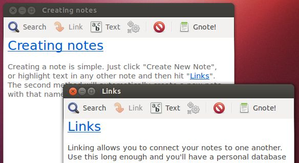
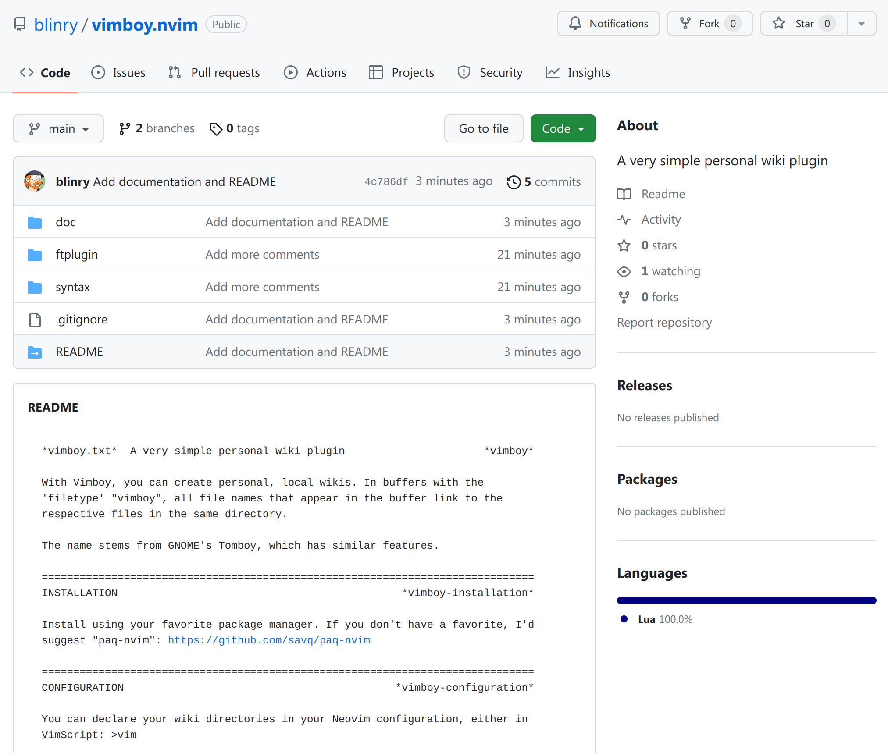

<style>
    section::after {
        content: attr(data-marpit-pagination) ' / ' attr(data-marpit-pagination-total);
    }
    section.lead {
        background-color: #0d2f54 !important;
    }
</style>

<style scoped>
h1 {
    font-size: 250%;
}
h2, h3 {
    color: #aaa;
}
</style>

# Why you might want<br> a personal wiki

## blinry

### MRMCD 2023

# blinry

- playful things with bits and pixels!


---


---


---


---


# My personal wiki!

- I use it every day
- I love it very much
- It's an essential part of my life
- It's extremely simple


# Goals for this talk

1) Show you how my wiki works and how I use it
2) Inspire you to create your own wiki
3) Make it easy for you to get started

# History of my wiki <!-- _class: lead -->

---

<style scoped>
img {
    background: white;
    padding: 1rem;
}
</style>

* 2007: Started with a `diary` text file
* 2008: Added other text files (`ideas`, `todo`, `quotes`)
* 2010: Tried MediaWiki briefly
    * 
* 2011: Built Vimboy!

# Inspiration: Tomboy 

<style scoped>
h1 img {
    position: relative;
    top: 0.2em;
}
</style>



# Vimboy

- 54 lines of Lua
- as simple as possible



<!-- _footer: https://github.com/blinry/vimboy.nvim -->

---

```
~/permanent/wiki/ $ ls
Blender
Nodevember
Geometry nodes
Neu
Tofu süß-sauer
Kopfschmerzen
Flugsimulator
Im Alltag urst wohl fühlen
Augen
Dutil-Dumas-Message
Bibimbap
Bluetooth-Kopfhörer
Vorhersagen
Stuttgart
Korrekte Aussprache
Hardware Prototype Fund
Scheitern
Piercing
Aftershokz
Überzeugungen
Sommerrollen
...
```

---


# How to create links?

Two options:

* Using a special syntax, `[[like this]]`
* Automatically, as soon as a page is mentioned
    * I *really* like automatic links!

# What I use my wiki for <!-- _class: lead -->

# What do I use it for? (1/4)

* time & task management
* tracking of goals and habits
* weekly/monthly reflection
* lists of things I want to watch/read/cook/play
* idea collection (!)
* address book
* project notes
* diary, mental health tools, emotional processing
* shopping list

# What do I use it for? (2/4)

* wish list
* collecting random interesting things
* stuff I want to learn
* travel plans
* dream journal
* packing list
* checklists (cleaning, project lifecycle)
* quote collection

# What do I use it for? (3/4)

* health notes
* time tracking
* documentation for myself (on software, configuration, processes)
* money bookkeeping
* food preferences
* logs on weight loss
* notes about events
* purchase decisions
* recipes

# What do I use it for? (4/4)

* cheat sheets (time zones, postage)
* book summaries
* my clothing sizes
* note-taking in classes
* ...and much more!

# Statistics

* 1700 pages
* 9 MB of text
* 3.8 million characters, 500 thousand words
* added ~800 characters/day
* longest page: 200 kB (`Diary`)
* shortest page: 3 bytes (content: `:)\n`)
* 2700 commits
* File that has been unmodified for the longest time: `Morning pages`

---

<style>
    video {
        position: absolute;
        top: 0;
        left: 0;
        width: 100%;
        height: 100%;
    }
</style>

<video src="gource.mp4" controls></video>

# What sucks?


* No graphics
* No hierarchy
    * For big projects with many "subpages", I usually create a second wiki.
    * Flat hierarchies are simpler, though. Easy to decide where stuff goes.

# What's great?

* Obvious place to put documentation
* Notes at my fingertips
* Getting things off my mind
* Generate new ideas through links


# How my wiki works <!-- _class: lead -->

# Structure

- A single directory of text files
    - I use `~/permanent/wiki/`
- Roughly markdown content

<!-- _footer: https://blinry.org/home-sweet-home/ -->

# Setting the `vimboy` filetype

In my Neovim configuration:

```lua
vim.api.nvim_create_autocmd({"BufNewFile", "BufRead"}, {
    pattern = os.getenv("HOME") .. "/permanent/wiki/*",
    callback = function()
        vim.bo.filetype = "vimboy"
    end
})
```

# Structure of the plugin

In `~/.local/share/nvim/site/pack/dev/start/vimboy/`:

* `syntax/vimboy.lua`
* `ftplugin/vimboy.lua`

# `syntax/vimboy.lua`

```lua
-- Link the 'vimboyLink' highlight group to the existing 'Underlined' group.
vim.api.nvim_set_hl(0, "vimboyLink", {link = "Underlined"})

-- Remove all existing vimboyLink syntax matches.
vim.cmd('syntax clear vimboyLink')

-- Find the directory of the current file.
local base_dir = vim.fn.expand('%:h')

-- Loop through all files in the directory, and add a syntax match for each one.
for _, file in ipairs(vim.fn.readdir(base_dir)) do
    vim.cmd('syntax match vimboyLink /\\c\\V\\<' .. vim.fn.escape(file, '/\\') .. '/')
end
```

# Stand back, I know regular expressions!

`/\c\V\<Example/`

* `\c`: ignore case
* `\V`: very nomagic
* `\<`: beginning of a word

# `ftplugin/vimboy.lua`

```lua
-- Basic keybindings.
vim.keymap.set('n', '<CR>', OpenLinkUnderCursor)
vim.keymap.set('v', '<CR>', OpenVisualSelection)

-- When entering or deleting a buffer, re-run syntax definitions.
vim.api.nvim_create_autocmd({'BufEnter', 'BufDelete'}, {command='doautoall syntax'})
```

# `ftplugin/vimboy.lua`

```lua
-- Open the link under the cursor, or the word under the cursor if no link is found.
function OpenLinkUnderCursor()
    local cursor_col = vim.fn.col('.')
    if IsOnLink(cursor_col) then
        local lengthOfLine = #vim.fn.getline('.')
        local minCol = FindEndOfLink(cursor_col, 1, -1)
        local maxCol = FindEndOfLink(cursor_col, lengthOfLine, 1)
        local fileToOpen = string.sub(vim.fn.getline('.'), minCol, maxCol)
        OpenPage(fileToOpen)
    else
        vim.cmd('normal! viw')
        OpenVisualSelection()
    end
end
```

# `ftplugin/vimboy.lua`

```lua
-- Loop through the characters of the current line, until we're no longer on a link.
function FindEndOfLink(start_col, end_col, diff)
    for col = start_col, end_col, diff do
        if not IsOnLink(col) then
            return col - diff
        end
    end
    return end_col
end

-- In the line of the cursor, is this column on a link?
function IsOnLink(col)
    local cursor_line = vim.fn.line('.')
    return #vim.fn.synstack(cursor_line, col) > 0
end
```

# `ftplugin/vimboy.lua`

```lua
-- Open the current visual selection.
function OpenVisualSelection()
    vim.cmd('normal! ^[')
    local minCol = vim.fn.col("'<")
    local maxCol = vim.fn.col("'>")
    local fileToOpen = string.sub(vim.fn.getline('.'), minCol, maxCol)
    OpenPage(fileToOpen)
end
```

# `ftplugin/vimboy.lua`

```lua
-- Open the page with the given name.
function OpenPage(name)
    local file_name = vim.api.nvim_buf_get_name(0)
    local base_dir = file_name:match(".*/")

    local fileToOpen = name

    if vim.fn.filereadable(name) == 0 then
        -- If the file doesn't exist, try to find versions of the file with different casing.
        for _, file in ipairs(vim.fn.readdir(base_dir)) do
            if string.lower(name) == string.lower(file) then
                fileToOpen = file
                break
            end
        end
    end
    vim.cmd('edit ' .. vim.fn.fnameescape(fileToOpen))
end
```


# Surrounding tools <!-- _class: lead -->

# Quick access with `w`

(Access in 1-2 seconds.)

<video src="fzf.mp4" controls></video>

---

`w` script:

```bash
cd ~/permanent/wiki/

if [ -z "$*" ]; then
    PAGE="$(fd|fzf --print-query|tail -1)"
else
    PAGE="$*"
fi

if [ -n "$PAGE" ]; then
    "$EDITOR" "$PAGE"
fi
```

# `w`: Tab completion

For the fish shell:

```fish
complete -c w -a '(pushd .; cd ~/permanent/wiki; ls; popd)'
```

See: ["Woher weiß die Shell was sie tun soll wenn ich TAB drücke?"](https://talks.mrmcd.net/2023/talk/SRSSUV/) by pseyfert

# Headers

```
I like headers like these!
==========================

And these
---------
```

```
# Other people like headers like these

## And these
```

# Mappings for headers

```lua
-- Underline the current line with - or =.
for _, v in pairs({'-', '='}) do
    vim.keymap.set('n', '<Leader>' .. v, function()
        local len = #vim.api.nvim_get_current_line()
        local underline = string.rep(v, len)
        vim.api.nvim_put({underline}, "l", true, true)
    end)
end
```

# Timestamping for logs

- `d<Tab>` inserts `2023-08-25`
- `dt<Tab>` inserts `2023-08-25T15:09+02:00`

I use UltiSnips for this:

```
snippet d "YYYY-MM-DD" i
`date +"%Y-%m-%d"`
endsnippet

snippet dt "YYYY-MM-DDThh:mm+xx00" i
`date -Iminutes`
endsnippet
```

<!-- _footer: https://github.com/SirVer/ultisnips -->

# Checklists

```
- look
- like
+ this
```

`+` mapping to replace any of `-`, `?`, `~` or `x`:

```lua
vim.keymap.set('n', '+', function()
    vim.cmd('s/^\\s*\\zs[-x~?]/+')
    vim.cmd('w')
end)
```

# Priorized lists

- prefix lines with numbers from 0 to 5
- use `:!sort` in Vim

```
Workshop ideas:

5 - visidata
5 - Video editing with Blender
4 - Bitsy
3 - Flexbox
2 - Twine
1 - Go (the game)
0 + CSS art
```

# Autosave

https://github.com/907th/vim-auto-save

`~/.config/nvim/ftplugin/vimboy.vim`:

```vim
let g:auto_save = 1
let g:auto_save_silent = 1
```

# Search with rg


<!-- _footer: https://github.com/BurntSushi/ripgrep -->

# vim-table-mode


<!-- _footer: https://github.com/dhruvasagar/vim-table-mode -->

# `git blame`


# `pl` script for packing lists

```
cp ~/permanent/wiki/Packliste ~/tmp/pl
vim ~/tmp/pl
```

# graphboy


# graphboy


# Mobile syncing <!-- _class: lead -->

# Multi-device setup

Super important for me to always have access to the wiki!

# Roboboy


<!-- _footer: https://github.com/blinry/roboboy -->

---


<!-- _footer: https://termux.dev -->

---


# Termux configuration

`~/.termux/termux.properties`:

```
extra-keys = [["TAB", "LEFT", "DOWN", "UP", "RIGHT", "KEYBOARD"]]
terminal-onclick-url = open
back-key = escape
```

---

`wikisync` script:

```bash
cd ~/permanent/wiki
git add -A
git commit -m "Sync"

git fetch
git merge origin/main && git push
```

# Possible alternative: Syncthing

https://syncthing.net

# Ethersync

**Real-time collaborative editing of local text files.**


If you'd be excited about this – talk to me!


# How to get started <!-- _class: lead -->

# Vimboy

* https://github.com/blinry/vimboy (VimScript version)
* https://github.com/blinry/vimboy.nvim (Lua rewrite for Neovim)

# Obsidian


<!-- _footer: https://obsidian.md – See: [Informationsflut - Wie ich mein Chaos im Wasserglas bändige](https://talks.mrmcd.net/2023/talk/8CEVHR/) by Markus -->

# Start with a folder of plaintext files

* Build your own wiki software, maybe?


# Thanks! <3 <!-- _class: lead -->

:house: https://blinry.org

:elephant: [@blinry@chaos.social](https://chaos.social/@blinry)

:coin: https://patreon.com/blinry

:love_letter: https://tinyletter.com/blinry

<br>

Slides: https://blinry.org/wiki-talk/


<!--

---


# Having information on the go

- Write down/look up people's names! :D
- Write down random ideas

# Being able to dump thoughts

- Having a random idea? Write it down!

- project ideas (for software, art, talks, workshops, games, hardware, music, research)
- cooking ideas

# Self-organization: daily plan/weekly plan/miscellaneous

# Digression: How I learn with the wiki

- Keeping a list of open questions is really powerful for me!
- Writing down important information as I go

# I even used it as a calendar once

- Worked okay, actually!
- I missed repeating events and good visual representations


# A detour to my HOME file structure

# (Build a VSCode plugin as preparation?)
# (Polish Vim plugin as preparation)
# Reference: https://blinry.org/keeping-a-personal-wiki/

-->
