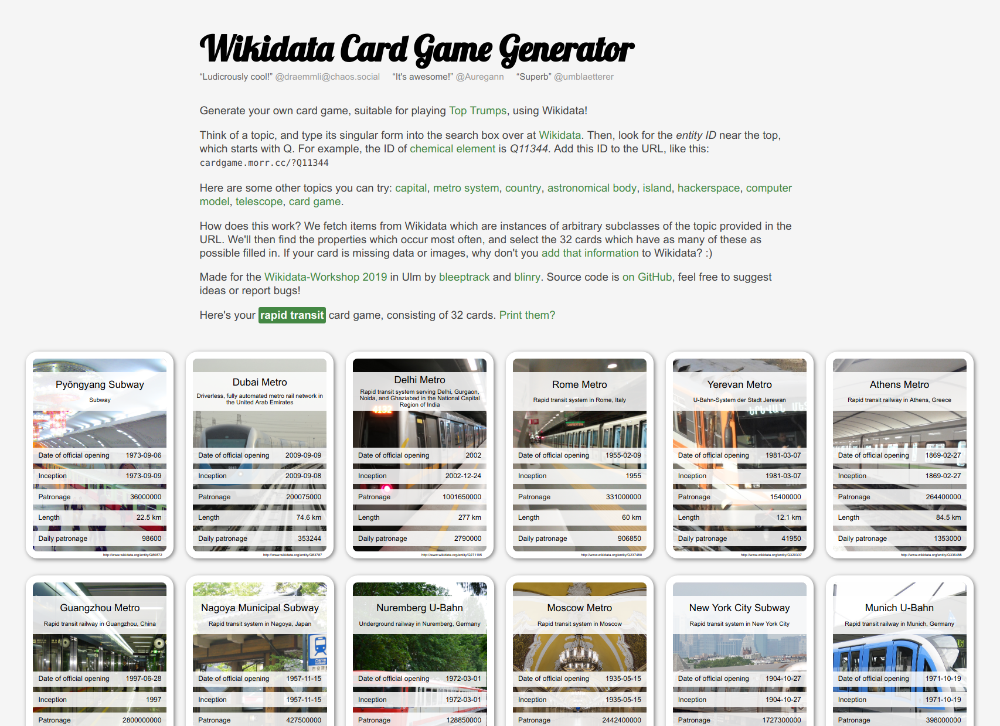

At this year's iteration of the [Wikidata workshops](https://de.wikipedia.org/wiki/Wikipedia:Wikidata-Workshop-Ulm-2019) in Ulm, [bleeptrack](https://www.bleeptrack.de/) and I built a *Wikidata Card Game Generator*! It uses [Wikidata](https://www.wikidata.org), the free and open knowledge base, to generate fact cards on arbitrary topics, like metro systems, planets, or hackerspaces!

People seem to enjoy it! Check it out here: <https://cardgame.morr.cc>

Our secret plan is that people will complain that a lot of information is missing on the cards, and will then add it to Wikidata to fix that! :D

Like Wikidata, the project is available under the terms of [CC0](https://creativecommons.org/publicdomain/zero/1.0/). The source code is available [on GitHub](https://github.com/blinry/wikidata-cardgame). If you wanna help improve it, have a look at the the [issues](https://github.com/blinry/wikidata-cardgame/issues)! And let us know if you find interesting decks!

