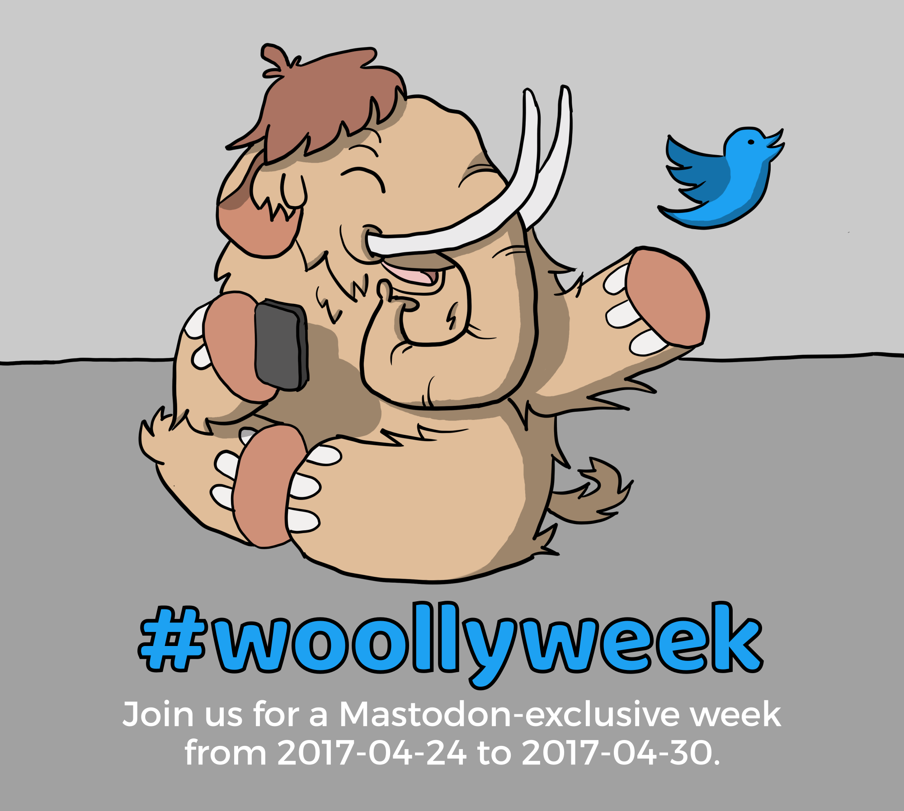

*TL;DR: We invite you to join us for a **Mastodon-exclusive week**! Starting this Monday, [**2017-04-24 at 0:00 UTC**](https://www.timeanddate.com/countdown/generic?iso=20170424T00&p0=1440&msg=%23woollyweek&font=sanserif), log out of all your Twitter clients, and don't log back in for a week.*

You might have heard of the Mastodon social network, it's an *open-source, decentralized, community-built* alternative to Twitter. You have 500 characters per post, no ads, and many instances explicitly ban discrimination and harassment. Its mascot is a woolly, mammoth-like animal, and instead of tweets you write toots! We think that's cute. And by now, the network consists of more than 1000 independent active instances with over 400,000 registered accounts!

In our experience, a *hard cut* works best for trying out new platforms like this. Some of us have made exceptionally good experiences with such a Mastodon-exclusive week. On the one hand, you will get to know Mastodon inside-out during this week, and on the other, it might convince your Twitter friends to come with you!
Maybe some of them even already have Mastodon accounts? You can find them using [the Mastodon Bridge](https://mastodon-bridge.herokuapp.com/).

## Here's how you can prepare (right now!)

1. **Choose a Mastodon instance.** Don't worry, almost all of them are connected to each other, so you'll be able to talk to all Mastodon users! But here are some recommendations:

    - [octodon.social](https://octodon.social) is a nice general-purpose instance with reasonable rules.
    - [witches.town](https://witches.town) is a nice place for LGBT+ activists, feminists, anarchists and stuff as well as their sympathizers. Registration opens every day from 18:00 UTC to 19:00 UTC.
    - [awoo.space](https://awoo.space) was created to be a safe space with very strict rules and moderation. They work with a whitelist to control which instances they connect to.
    - [chaos.social](https://chaos.social) is an instance for and by people close to the Chaos Computer Club.
    - If you're feeling courageous, you can also take a look at the [complete list of instances](https://instances.mastodon.xyz/list). Read the respective "About this instance" pages until you find an instance you like!
2. **Register an account there**, and try out all the functions! Remember to add an avatar and a short bio to your profile. [Here's](https://hackernoon.com/what-i-wish-i-knew-before-joining-mastodon-7a17e7f12a2b) a good introductory article to get you started.
3. We recommend to **make an announcement on Twitter** before the week starts. Link to your new Mastodon account (and maybe this page?), and use the hashtag `#woollyweek` (note the double-L! ^\_^). Pin that tweet, and change your username to "(see pinned tweet)" or something like that, so your followers can find out what's going on.
4. Before Monday, [**2017-04-24 at 0:00 UTC**](https://www.timeanddate.com/countdown/generic?iso=20170424T00&p0=1440&msg=%23woollyweek&font=sanserif), say good-bye to your Twitter followers, **log out of all your clients**, and pledge not to log back in for a week.

## Fun things to try in your first Mastodon week:

- Post an `#introduction`! Include many hashtags so people with similar interests can find you!
- Then, click on your own hashtags to find people with shared interests and follow them!
- Many of us enjoy having more than one account. For example, [tenforward.social](https://tenforward.social) is a Star Trek-themed instance, suitable for roleplaying. [oulipo.social](http://oulipo.social/) is a lipogrammatic instance where you are not allowed to use the letter "e". On [dolphin.town](https://dolphin.town), on the other hand, you're *only* allowed to use the letter "e".
- If you have any questions, you're very welcome to contact [@blinry](https://chaos.social/@blinry) or [@TQ](https://octodon.social/@TQ), who will be glad to help you with any problems you might encounter.

---

This is a list of Mastodon members who will participate in the #woollyweek. Want to join us? Ping [@blinry](https://chaos.social/@blinry) to be added to the list! We're looking forward to have you with us!

- [@TQ](https://octodon.social/@TQ) (who wrote a number of articles about the [possibilities and restrictions of Mastodon](https://medium.com/@thisisTQ), and had the idea for this campaign)
- [@rixx](https://chaos.social/@rixx) (who co-maintains [chaos.social](https://chaos.social))
- [@winniehell](https://octodon.social/@winniehell)
- [@NinahMarie](https://social.tchncs.de/@NinahMarie)
- [@daniel_bohrer](https://octodon.social/@daniel_bohrer)
- [@necrosis](https://chaos.social/@necrosis)
- [@HashDot](https://mastodon.hafen.io/@HashDot) (who runs [mastodon.hafen.io](https://mastodon.hafen.io/) and would like to connect with other Mastodon admins)
- [@maggo](https://chaos.social/@maggo)
- [@milan](@milan@social.tchncs.de)
- [@niklas](https://bonn.social/@niklas)
- [@vanecx](https://mastodon.pirateparty.be/@vanecx)
- [@viktorstrate](https://mastodon.cloud/@viktorstrate)
- [@cdevroe](https://mastodon.cloud/@cdevroe)
- [@ax](https://octodon.social/@ax)
- [@td00](https://chaos.social/@td00)
- [@john](https://mastodon.cloud/@john)
- [@zuphzuph](https://mastodon.technology/@zuphzuph)
- [@ornithocoder](https://mastodon.technology/@ornithocoder)
- [@sarnthil](https://mastodon.social/@sarnthil)
- [@l3viathan](https://mastodon.social/@l3viathan) (who was the first to do the Twitter-abstinence thing)
- [@c0rdis](https://mastodont.social/@c0rdis) (who runs [mastodont.social](https://mastodont.social/))
- [@Howl](https://mastodonti.co/@Howl)
- [@MrGilbert](https://soshl.one/@MrGilbert)
- [@blinry](https://chaos.social/@blinry) (who set up this page)
