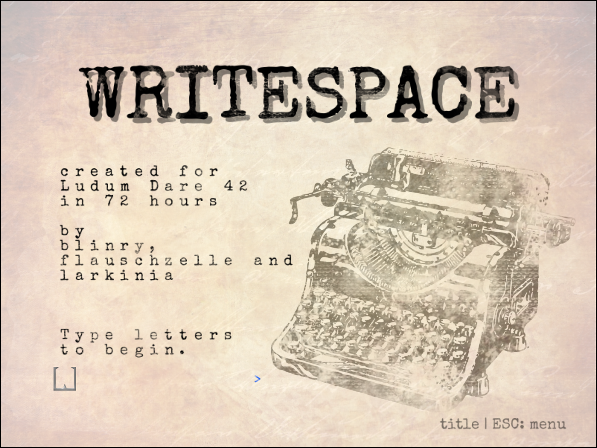
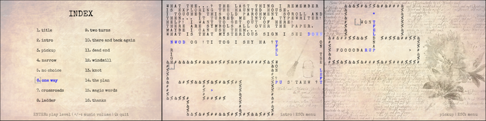

Writespace is a puzzle game with simple mechanics, but interesting implications. It was made in 72 hours for Ludum Dare 42, together with [Kiki](http://metakiki.net) and [larkinia](https://ldjam.com/users/larkinia), and [Lena](https://lenaschimmel.de) and [rohieb](https://rohieb.name) jumped in last-minute to help with the graphics!

As for the story: *You’re exploring a haunted house and find a strange parchment scroll. When you touch it, something terrible happens: You’re turned into a typewriter! Use your surroundings and find the magic words to lift the curse! Oh, and you can’t type spaces, of course.*

You download the game from [the Ludum Dare website](https://ldjam.com/events/ludum-dare/42/writespace).

## Development

Last time, our level format was SVG – now we just used text files. Personally, I had the most fun exploring the implications of our own rules. There were quite a few "aha moments", and we tried to put those into the game for the players to experience, as well.

## Coverage

This game got quite a bit of coverage. There were some short articles written about our game. Both contain recordings (without commentary):

- [Alpha Beta Gamer](https://www.alphabetagamer.com/writespace-game-jam-build/)
- [gamejamcurator](https://gamejamcurator.tumblr.com/post/177162841106/ludum-dare-42-writespace)

Joshua did a rather long stream, with fun commentary:

<%= twitch("298094346", start: "01h25m45s") %>

Randomise User recorded a short playthrough:

<%= youtube("u3EkWjGULzg", start: 541) %>

Pixtxa recorded a full playthrough (with German commentary):

<%= youtube("297622477", start: "00h01m55s") %>

And EliteKessu also did a full playthrough with hilarious meta commentary through the game's user interface:

<%= youtube("Tfb71n08BRo") %>
<%= youtube("mRaeQie3yz8") %>
<%= youtube("MZBPnaXiE9Y") %>

## Comments

*This is an aesthetic bomb. I absolutely love the visuals you chose, and the theme is implemented beautifully. Extra points for the sound design, the gentle typewriter clicks and dings did it for me!* --Shess

*Brilliant game. I spent the last 40 minutes playing this game and enjoying myself with puzzles and the beautiful aesthetics. Love the seemly simple mechanics can actually generate4 so many interesting puzzle especially the later ones involving finding out clever ways of getting around tight spaces and dead ends.* --jackyjjc

*Wow, this game blew my mind, supernice, this is incredible 5/5* --oskarOlausson
