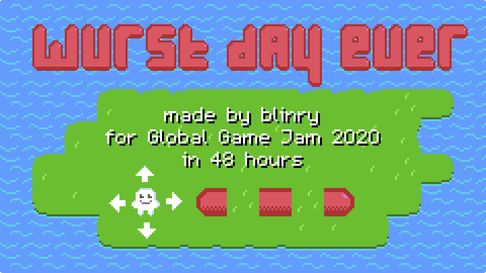

An abstract 2D puzzle game, inspired by Sokoban, Snakebird, and Stephen's Sausage Roll. **Repair all sausages to win!** Like [Writespace](/writespace/), this is a game with simple rules, but a lot of interesting consequences! I had a lot of fun discovering these consequences for myself and designing the levels. Each level holds a new idea for the player to discover. You can [**play it in your browser!**](play/)

Alternatively, you can download binaries for [Linux](https://github.com/blinry/wurst-day-ever/releases/download/1.0.0/wurst-day-ever-linux.zip), [macOS](https://github.com/blinry/wurst-day-ever/releases/download/1.0.0/wurst-day-ever-macos.zip), and [Windows](https://github.com/blinry/wurst-day-ever/releases/download/1.0.0/wurst-day-ever-windows.zip).

## Praise

*"My favorite game at Global Game Jam Berlin!"*

*"You should add a few more levels, and then just put it on Steam!"*

*"Obviously, you know how to design puzzle games."*

## Story

This year, I participated in the *Global Game Jam* for the first time! I have a lot of experience with the *Ludum Dare* game jam, where you participate with your group from your own home. But at GJJ, you actually go to predefined sites, to participate with other follow jammers in person! I joined the folks in Berlin meetin at the SAE institute, and I enjoyed the experience a lot, especially demoing the resulting games to each other in the end in a fabolous presentation!

Also, it's the largest game jam in the world, with about 50000 participating at the same time. This year's theme was "Repair"! I intentionally wanted to make a solo submission, to see what I could come up with in 48 hours, and I'm super happy with the result!

[Winnie](https://winniehell.de) created an original score for the game, which I really love! Thanks!

## Development

I tweeted a bit about the development of the game:

<%= tweet(1223536386172760067) %>

<%= tweet(1223537630316503040) %>

<%= tweet(1223574871034290176) %>

<%= tweet(1223651117621489664) %>

<%= tweet(1223751233430790144) %>
