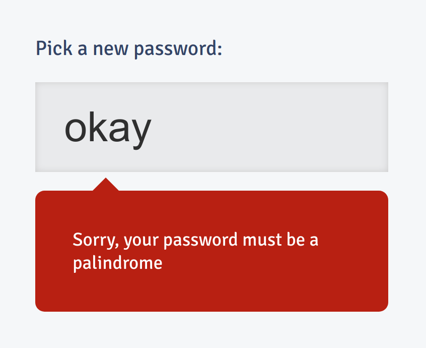

[Bine](https://bleeptrack.de) and I made this little game for the infamous [The Boston Stupid Shit No One Needs & Terrible Ideas Hackathon](https://bostonstupidhackathon.com) in a single day.

It's a game about finding the perfect password that fulfills all criteria. :P It has three levels, and takes a few minutes to play. 

[**Play it in your browser!**](https://youshallnotpass.glitch.me)

## Development

We developed the game using Glitch, which worked amazingly well! You can look at the source code (or remix the project) [here](https://glitch.com/edit/#!/youshallnotpass).

As so often, we got a lot of super helpful input from our followers on Twitter and Mastodon when we posted about your work-in-progress, see the replies to theese tweets:

<%= tweet("1256636786425683968") %>
<%= tweet("1256681067962130432") %>

We definitely had more ideas than time, so who knows, there might be an extended ersion in the future? :)
